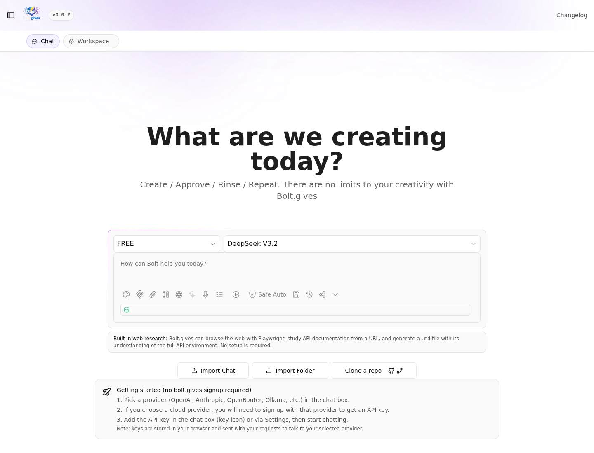
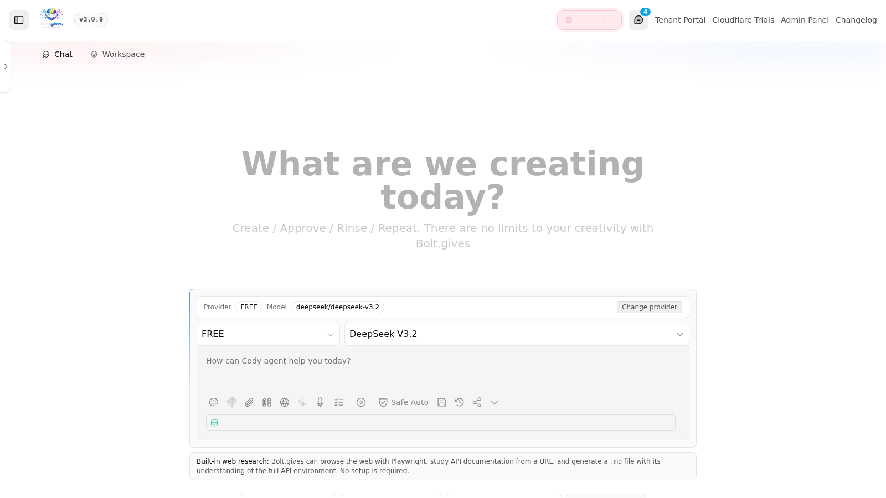
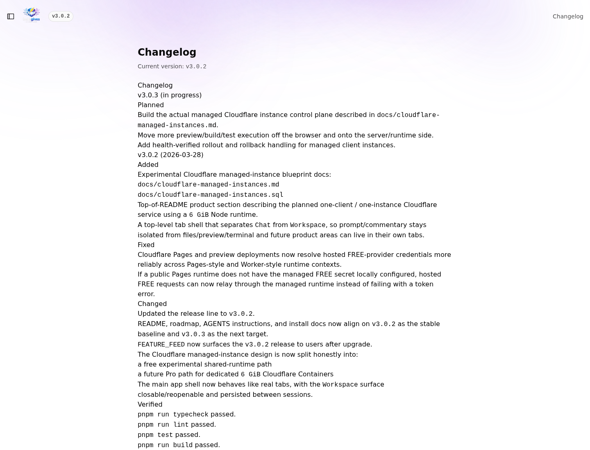

<p align="center">
  
</p>

<p align="center">
  collaborative, open-source ai coding workspace
</p>

<p align="center">
  <a href="https://bolt.gives">
    
  </a>
</p>

<p align="center">
  <a href="https://alpha1.bolt.gives">live alpha</a> ·
  <a href="CHANGELOG.md">changelog</a> ·
  <a href="#quickstart-local-development">install</a>
</p>

## Version

Current version: **v1.0.2**

bolt.gives is a collaborative, open-source AI coding workspace.

Release branch status (2026-02-17):
- `main` → `v1.0.2`
- `alpha` → `v1.0.2`

It combines:
- A browser-based Node.js dev environment (StackBlitz WebContainer)
- An AI-assisted editor + terminal
- Real-time collaborative editing
- Agent-style workflows (Plan/Act with checkpointed execution)

## Steps towards v1.0.2 - completed

### Delivery Paths (P0)

1. Live Development Commentary Stream
- [x] Stream concise step-by-step commentary while coding (`plan -> action -> verification -> next step`).
- [x] Separate commentary from code/actions in protocol and UI.
- [x] Keep commentary visible while work is in progress (not only at completion).

2. Agent Anti-Stall + Auto-Recovery
- [x] Detect stuck states (repeated tool calls, no-progress loops, long inactivity/timeouts).
- [x] Add recovery strategies (retry/backoff, summarize-and-continue, explicit recovery prompt).
- [x] Surface recovery actions in the commentary timeline.

3. Execution Transparency Panel
- [x] Show selected model, tool invocations, active step, elapsed time, and token/cost estimate.
- [x] Show a short "why this action" reason for major agent steps.
- [x] Persist per-run execution trace for review.

4. Safer Autonomy Modes
- [x] Add explicit modes: `read-only`, `review-required`, `auto-apply-safe`, `full-auto`.
- [x] Add per-tool approval policy controls.
- [x] Display active autonomy mode in chat/workflow UI at all times.

5. Reliability Guardrails For Web/Tool Tasks
- [x] Keep tool schemas compatible with strict providers (including Codex-style strict function validation).
- [x] Add robust URL/tool input validation with clear fallback errors for users.
- [x] Add regression tests for schema compatibility across major model families.

### Next Paths (P1)

6. Persistent Project Memory (Scoped)
- [x] Store lightweight persistent project summaries/architecture notes between sessions.
- [x] Use persisted memory to reduce repeated context rebuilding.

7. Sub-Agent Framework (Minimal)
- [x] Introduce a manager/worker pattern for long-running tasks.
- [x] Ship behind a feature flag.

### Acceptance Criteria

1. Commentary appears within 2 seconds of run start and updates at each meaningful step.
2. At least 90% of interrupted/stalled runs auto-recover or provide a clear recovery suggestion.
3. Users can switch autonomy mode before and during a run; mode is reflected in every tool action.
4. Tool/schema compatibility tests pass for strict OpenAI Codex-style models and standard chat-completions models.
5. Timeline view logs model, tools, approvals, and outcome per run.

### Success Metrics

- Reduce "agent got stuck" reports by at least 40%.
- Increase successful end-to-end task completion rate by at least 20%.
- Reduce average manual "continue" interventions per session.
- Increase user satisfaction on "I understand what the agent is doing."

### Research Sources (Playwright Browsed)

- https://forum.cursor.com/c/ideas
- https://forum.cursor.com/c/ideas/7
- https://codeium.canny.io/feature-requests
- https://news.ycombinator.com/item?id=44031432
- https://news.ycombinator.com/item?id=45534880
- https://github.com/openai/codex/issues
- https://github.com/features/copilot
- https://github.com/orgs/community/discussions/categories/copilot
- https://developers.openai.com/codex/

## Platform Support (Important)

- Using bolt.gives in a browser: supported on Windows, macOS, and Linux (any modern browser).
- Installing / self-hosting bolt.gives: supported on **Ubuntu 18.04+ only**.
  - Windows is **not supported** for installation/self-hosting.
  - macOS is **not supported** for installation/self-hosting.
  - If you are on Windows or macOS, use the hosted web app (or deploy to an Ubuntu server and access it from your machine).

## v1.0.2 Highlights

- Live development commentary stream (separate protocol event, visible during execution).
- Anti-stall detection and auto-recovery with recovery events in timeline.
- Execution transparency panel with model/tool/step/cost visibility and rationale.
- Safer autonomy modes (`read-only`, `review-required`, `auto-apply-safe`, `full-auto`) with runtime enforcement.
- Reliability guardrails for strict tool schemas with compatibility matrix endpoint and tests.
- Persistent scoped project memory reused across runs.
- Minimal planner/worker sub-agent framework behind feature flag (`BOLT_SUB_AGENTS_ENABLED`).

## v1.0.0 Release Notes

This `v1.0.0` release focuses on shipping a complete, end-to-end collaborative AI coding workspace:
- Real-time collaboration via Yjs (`y-websocket`) with persisted docs and a health endpoint
- Plan/Act agent workflow with checkpointed execution and revert support
- Multi-provider model support (cloud + local) with an in-app model orchestrator
- Session save/resume/share (optional Supabase-backed storage)
- Deployment wizard and provider integrations (GitHub/GitLab + Vercel/Netlify)
- Production builds with Cloudflare Pages support (see `wrangler.toml`)

## Screenshots

Home:


Chat:


Plan prompt example:


Changelog:


## What The App Does

bolt.gives is a single workspace where you can:
- Chat with an LLM and apply changes as diffs/files inside the project
- Run commands in an integrated terminal with incremental progress events
- Collaborate with multiple people on the same file (live cursors/edits)
- Save/resume/share sessions (optional Supabase-backed storage)
- Deploy generated apps (wizard-driven configuration)

## Key Features

- Multi-provider LLM support (cloud + local)
- Real-time collaborative editing (Yjs + `y-websocket`)
- Built-in web documentation browsing and synthesis tools (Playwright-backed)
- Interactive step runner with structured events (`step-start`, `stdout`, `stderr`, `step-end`, `complete`)
- Plan/Act workflow with checkpoints (continue/stop/revert)
- Session save/resume/share (Supabase REST API)
- Model orchestrator (auto-selects an efficient model and surfaces the decision in chat metadata)
- Performance monitor (CPU/RAM sampling + token usage counter)
- Deployment wizard (generates provider workflows/config)
- Plugin manager + marketplace registry support

## Quickstart (Local Development)

### Prereqs (Ubuntu 18.04+ Only)

- Ubuntu `18.04+` (recommended: Ubuntu `22.04+`)
- Node.js `>= 18.18.0` (recommended: Node.js `22`)
- `pnpm` (recommended: via `corepack`)
- `git`

Notes:
- You can **use** bolt.gives on Windows/macOS in a browser.
- You cannot **install/self-host** bolt.gives on Windows/macOS today; use an Ubuntu 18+ server instead.

### Install Node.js + pnpm (Ubuntu)

This project builds a large Vite/Remix bundle and may require a larger Node heap during build.
Installation steps are unchanged for `v1.0.2`.

1. Install base packages:
   ```bash
   sudo apt-get update
   sudo apt-get install -y git curl ca-certificates build-essential
   ```
2. Install Node.js (recommended: `nvm`):
   ```bash
   curl -o- https://raw.githubusercontent.com/nvm-sh/nvm/v0.39.7/install.sh | bash
   # restart your shell, then:
   export NVM_DIR="$HOME/.nvm"
   . "$NVM_DIR/nvm.sh"
   nvm install 22
   nvm use 22
   node -v
   ```
3. Enable `pnpm` via corepack:
   ```bash
   corepack enable
   corepack prepare pnpm@9.15.9 --activate
   pnpm -v
   ```

Setup:
```bash
pnpm install
cp .env.example .env.local
```

Then edit `.env.local` and set at least one provider key you intend to use (example: OpenAI, Anthropic, etc).

Optional (guided env setup):
```bash
pnpm run setup
```

Run dev (starts the app, collaboration server, and web browsing service):
```bash
pnpm run dev
```

Defaults:
- App: `http://localhost:5173`
- Collaboration server: `ws://localhost:1234`
- Web browsing service: `http://127.0.0.1:4179`

### Production Build (High Memory)

If the build fails with "JavaScript heap out of memory", use:
```bash
pnpm run build:highmem
pnpm run start
```

## Deploying To Cloudflare Pages

This repo is configured for Cloudflare Pages via `wrangler.toml`:
- Build output: `build/client`
- Pages Functions entry: `functions/[[path]].ts`

If your Pages build runs out of memory, increase Node's heap:
- Set `NODE_OPTIONS=--max-old-space-size=6142` in Cloudflare Pages build environment
- Or use a high-memory build command: `NODE_OPTIONS=--max-old-space-size=6142 pnpm run build`
- Or run: `pnpm run build:highmem`

Fresh install checklist:
- `docs/fresh-install-checklist.md`

Install script (Ubuntu 18.04+ only):
```bash
./scripts/install-bolt-gives.sh
```

## Built-In Web Browsing

bolt.gives can now browse docs from user prompts like:
- `Study these API documentation: https://developers.cloudflare.com/workers/`

How it works:
- The model uses built-in tools: `web_search` and `web_browse`.
- `web_browse` reads the target URL with Playwright and extracts title, headings, links, and body content.
- The model can then create a Markdown study file directly in the workspace using `<boltAction type="file">`.

Configuration:
- `WEB_BROWSE_SERVICE_URL` (optional): URL for the browsing service.
  - Default: `http://127.0.0.1:4179`
- Browser install is handled during dependency install (`pnpm install`) via postinstall.
  - To skip browser download: `PLAYWRIGHT_SKIP_BROWSER_DOWNLOAD=1 pnpm install`

## Real-Time Collaboration

The editor uses Yjs and connects to a local `y-websocket` compatible server.

- Server script: `scripts/collaboration-server.mjs`
- Default WS URL: `ws://localhost:1234`
- Default persistence directory: `.collab-docs` (override with `COLLAB_PERSIST_DIR`)

Client settings (stored in browser localStorage):
- `bolt_collab_enabled` (defaults to enabled when unset)
- `bolt_collab_server_url` (defaults to `ws://localhost:1234`)

## Screenshots (Reproducible)

To refresh the screenshots used in this README:
```bash
./scripts/capture-screenshots.sh
```

Outputs:
- `docs/screenshots/home.png`
- `docs/screenshots/chat.png`
- `docs/screenshots/chat-plan.png`
- `docs/screenshots/changelog.png`

To capture screenshots from the live alpha environment instead of a local dev server:
```bash
SKIP_DEV_SERVER=1 BASE_URL=https://alpha1.bolt.gives ./scripts/capture-screenshots.sh
```

To generate a shared-session restore screenshot (requires Supabase configured in `.env.local`):
```bash
node scripts/e2e-sessions-share-link.mjs
```

## Validation Gate

Before pushing changes:
```bash
pnpm run typecheck
pnpm run lint
pnpm test
```

## Mailing List

Join our mailing list for future updates and release announcements:
- https://bolt.gives

## Docker Images (GHCR)

This repo includes a `Docker Publish` GitHub Actions workflow that can build and (optionally) push images to GitHub Container Registry.

By default, publishing is disabled. To enable pushing to GHCR:
1. Create an Actions variable: `GHCR_PUSH_ENABLED=true`
2. (Optional) Create an Actions secret: `GHCR_PAT` with `read:packages` and `write:packages`

Notes:
- If `GHCR_PAT` is not set, the workflow will fall back to the built-in `GITHUB_TOKEN`.
- Images publish to `ghcr.io/<owner>/<repo>`.

## Roadmap

See `ROADMAP.md`.

## Contributing (Fork + PR Workflow)

We follow a standard GitHub fork + PR workflow.

1. Fork this repository on GitHub.
2. Clone your fork locally:
   ```bash
   git clone https://github.com/<your-username>/bolt.gives.git
   cd bolt.gives
   ```
3. Add the upstream remote:
   ```bash
   git remote add upstream https://github.com/embire2/bolt.gives.git
   git fetch upstream
   ```
4. Create a branch off `main`:
   ```bash
   git checkout -b feat/my-change
   ```
5. Make changes and run the validation gate:
   - `pnpm run typecheck`
   - `pnpm run lint`
   - `pnpm test`
6. Push your branch to your fork and open a Pull Request targeting `embire2/bolt.gives:main`.

PR expectations:
- Keep PRs focused (one feature/bugfix per PR).
- Explain what changed, why, and how reviewers can verify it.
- Do not commit secrets. Put keys in `.env.local` (gitignored).

## License

MIT
