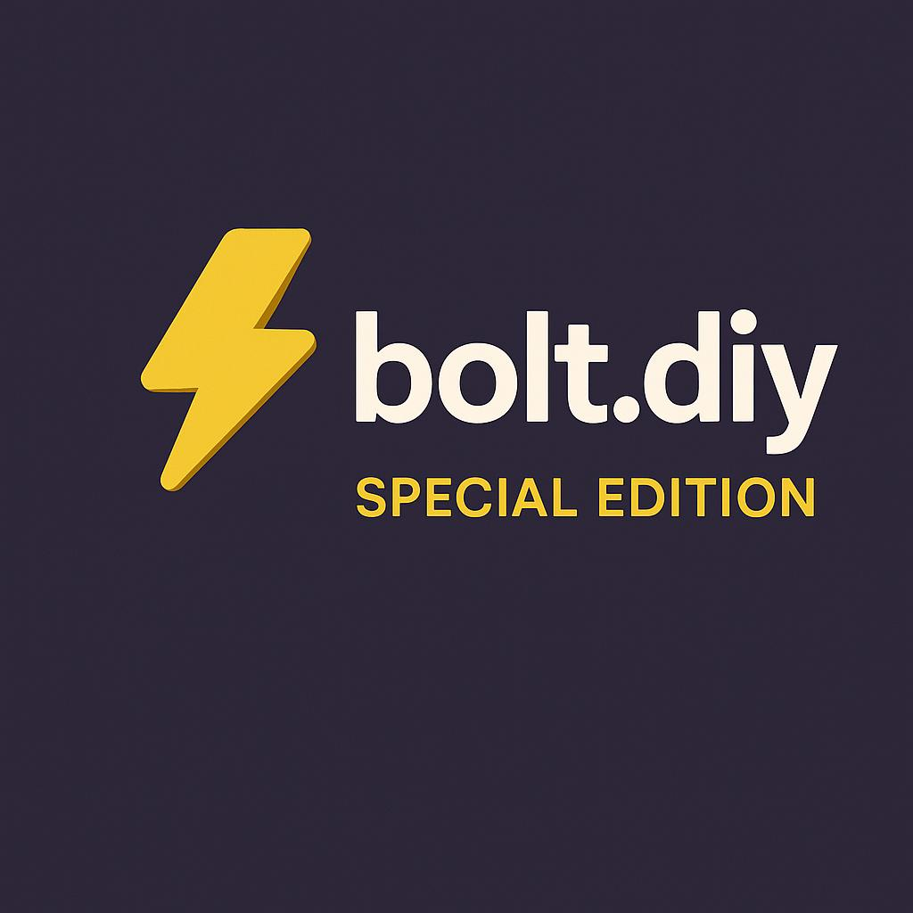

# Bolt.DIY - Special Edition

[](https://openweb.co.za)

Welcome to **Bolt.DIY - Special Edition**, a powerful alternative to StackBlitz's Bolt.new that puts community-driven development at the forefront. This special edition is maintained by a dedicated team of volunteers who are continuously adding highly requested features and improvements to create the most comprehensive open-source AI coding assistant.

## 🚀 What Makes This Special?

Bolt.DIY - Special Edition represents the next evolution of AI-powered web development, offering:

- **Community-Driven Development**: Built by volunteers who listen to user feedback and implement the features you actually want
- **Advanced Feature Set**: Enhanced capabilities that go beyond the basic Bolt.new experience
- **Multiple LLM Support**: Choose from OpenAI, Anthropic, Ollama, OpenRouter, Gemini, LMStudio, Mistral, xAI, HuggingFace, DeepSeek, Groq, and more
- **Production-Ready**: Robust features like user authentication, chat history management, and advanced deployment options
- **Extensible Architecture**: Easy to extend with new models and capabilities

## 🎯 Our Mission

We believe that the best AI coding tools should be open source, community-driven, and accessible to everyone. Our team of volunteers is dedicated to:

- **Listening to the Community**: Every feature request is considered and prioritized based on user needs
- **Rapid Innovation**: Faster development cycles than traditional corporate alternatives
- **Quality First**: Thorough testing and code review processes ensure stability and performance
- **Transparency**: Open development process with clear roadmaps and progress tracking

## 🛠️ Enhanced Features

### 🔐 User Authentication & Session Management
- **Multi-user Support**: Create separate accounts with isolated chat histories
- **Secure Authentication**: bcryptjs-powered password hashing
- **Session Persistence**: 7-day session management with automatic cleanup
- **User Profiles**: Manage account settings and preferences

### 💬 Advanced Chat Management
- **Private Chat History**: Each user has completely isolated chat data
- **Chat Export/Import**: Backup and restore your conversations
- **Chat Duplication**: Clone successful conversations for reuse
- **Smart Chat Metadata**: Enhanced organization and search capabilities

### 🎨 Enhanced UI/UX
- **Mobile-Friendly**: Responsive design that works on all devices
- **Dark/Light Theme**: Toggle between themes for comfort
- **Improved Navigation**: Streamlined interface with better user flow
- **Visual Feedback**: Real-time status indicators and progress tracking

### 🔧 Developer Tools
- **Advanced Terminal**: Full terminal output with error detection
- **Git Integration**: Clone, commit, and push directly to GitHub
- **File Diff View**: See exactly what changes are being made
- **Project Templates**: Quick start with pre-configured templates

### 🌐 Deployment & Integration
- **Multiple Deployment Options**: Direct deployment to Netlify, Vercel, and more
- **Supabase Integration**: Database integration for dynamic applications
- **Docker Support**: Containerized deployment for easy scaling
- **API Integration**: Connect with external services and APIs

## 📋 Volunteer Team Priorities

Our team is actively working on these high-priority features:

### 🔥 Currently in Development
- **Advanced File Locking**: Prevent unnecessary rewrites with intelligent diff detection
- **Multi-Model Orchestration**: Run multiple AI agents in parallel for complex tasks
- **Enhanced Prompting**: Optimized prompts for smaller LLMs and better code generation
- **VSCode Integration**: Seamless integration with popular development environments

### 🎯 Next Up
- **Document Upload**: Add knowledge base with design templates and coding standards
- **Voice Commands**: Natural language voice prompting for hands-free coding
- **Project Planning**: LLM-generated project plans with transparent decision-making
- **Advanced Error Handling**: Automatic error detection and resolution

### 🔮 Future Enhancements
- **Plugin System**: Extensible architecture for community-contributed features
- **Advanced Analytics**: Usage insights and performance metrics
- **Collaborative Features**: Real-time collaboration on projects
- **Enterprise Features**: SSO, audit logs, and advanced security options

## 🚀 Quick Start

### Prerequisites
- Node.js (LTS version recommended)
- pnpm (recommended) or npm

### Installation

1. **Clone the Repository**:
   ```bash
   git clone https://github.com/embire2/bolt.diy.git
   cd bolt.diy
   ```

2. **Install Dependencies**:
   ```bash
   pnpm install
   ```

3. **Start Development Server**:
   ```bash
   pnpm run dev
   ```

4. **Open in Browser**:
   Navigate to `http://localhost:5173`

### Docker Setup (Alternative)

1. **Build Docker Image**:
   ```bash
   docker build . --target bolt-ai-development
   ```

2. **Run Container**:
   ```bash
   docker compose --profile development up
   ```

## 🔑 API Configuration

### Adding API Keys
1. Open the application in your browser
2. Select your preferred AI provider from the dropdown
3. Click the pencil icon to edit
4. Enter your API key securely

### Supported Providers
- **OpenAI**: GPT-3.5, GPT-4, GPT-4 Turbo models
- **Anthropic**: Claude 3 Opus, Sonnet, Haiku
- **Google**: Gemini Pro, Gemini Pro Vision
- **Ollama**: Local model support
- **OpenRouter**: Access to multiple models
- **LM Studio**: Local model server
- **Mistral**: Mistral 7B, Mixtral models
- **xAI**: Grok Beta models
- **HuggingFace**: Open source models
- **DeepSeek**: DeepSeek Coder models
- **Groq**: Fast inference models
- **Cohere**: Command models
- **Together**: Collaborative AI models
- **Perplexity**: Search-augmented models
- **AWS Bedrock**: Enterprise AI models

## 🤝 Contributing

We welcome contributions from developers of all skill levels! Here's how you can help:

### Ways to Contribute
- **Feature Development**: Help implement new features from our roadmap
- **Bug Fixes**: Report and fix issues to improve stability
- **Documentation**: Improve setup guides and feature documentation
- **Testing**: Help test new features and provide feedback
- **UI/UX**: Contribute to design improvements and user experience

### Getting Started
1. Fork the repository
2. Create a feature branch (`git checkout -b feature/amazing-feature`)
3. Make your changes
4. Run tests (`pnpm test`)
5. Commit your changes (`git commit -m 'Add amazing feature'`)
6. Push to the branch (`git push origin feature/amazing-feature`)
7. Open a Pull Request

### Code Standards
- **TypeScript**: Strict type checking enabled
- **ESLint**: Code linting with Prettier formatting
- **Testing**: Jest/Vitest for unit tests
- **Documentation**: JSDoc comments for complex functions

## 📊 Available Scripts

- `pnpm run dev` - Start development server
- `pnpm run build` - Build for production
- `pnpm run start` - Run production build locally
- `pnpm run preview` - Preview production build
- `pnpm test` - Run test suite
- `pnpm run typecheck` - TypeScript type checking
- `pnpm run lint` - Run ESLint
- `pnpm run lint:fix` - Fix linting issues automatically
- `pnpm run deploy` - Deploy to Cloudflare Pages

## 🌟 Community & Support

### Join Our Community
- **Discord**: [Join our Discord server](https://discord.gg/bolt-diy) for real-time discussions
- **GitHub Issues**: Report bugs and request features
- **GitHub Discussions**: Ask questions and share ideas
- **Community Forum**: [oTTomator Think Tank](https://thinktank.ottomator.ai)

### Getting Help
- **Documentation**: Check our comprehensive docs
- **FAQ**: Common questions and solutions
- **Video Tutorials**: Step-by-step guides
- **Community Support**: Ask questions in our Discord

## 📈 Roadmap

We maintain a transparent roadmap showing our development priorities:

### Q1 2025
- Enhanced file management and diff system
- Advanced AI model orchestration
- Improved mobile experience
- Plugin system foundation

### Q2 2025
- Voice command integration
- Advanced project templates
- Collaborative features
- Enterprise security features

### Q3 2025
- VSCode extension
- Advanced analytics dashboard
- Multi-language support
- Performance optimizations

View our detailed roadmap: [Roadmap](https://roadmap.sh/r/ottodev-roadmap-2ovzo)

## 🏆 Acknowledgments

This project is made possible by our amazing community of volunteers:

- **Core Team**: Dedicated developers maintaining the codebase
- **Contributors**: Community members who submit features and fixes
- **Testers**: Users who report bugs and test new features
- **Documentation Team**: Writers who keep our docs up-to-date
- **Community Moderators**: Helpers who support users in our forums

## 📄 License

**MIT License** - See [LICENSE](LICENSE) for details.

**Important**: This project uses WebContainers API which requires [commercial licensing](https://webcontainers.io/enterprise) for production use in commercial, for-profit settings. Prototypes and POCs do not require a commercial license.

## 🔗 Links

- **Live Demo**: [https://bolt.diy](https://bolt.diy)
- **Documentation**: [Bolt.DIY Docs](https://stackblitz-labs.github.io/bolt.diy/)
- **Community**: [oTTomator Think Tank](https://thinktank.ottomator.ai)
- **Roadmap**: [Development Roadmap](https://roadmap.sh/r/ottodev-roadmap-2ovzo)
- **Support**: [GitHub Issues](https://github.com/embire2/bolt.diy/issues)

---

**Bolt.DIY - Special Edition**: Where community-driven development meets cutting-edge AI technology. Join us in building the future of AI-powered web development! 🚀
