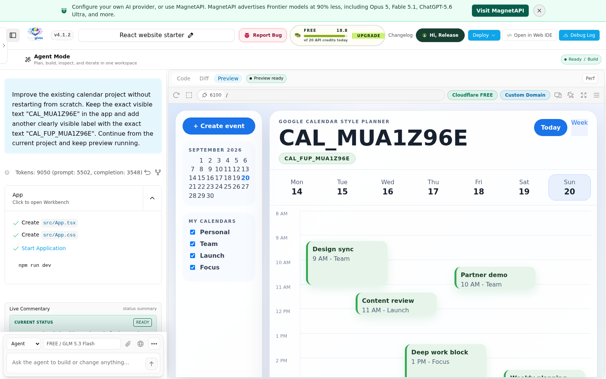
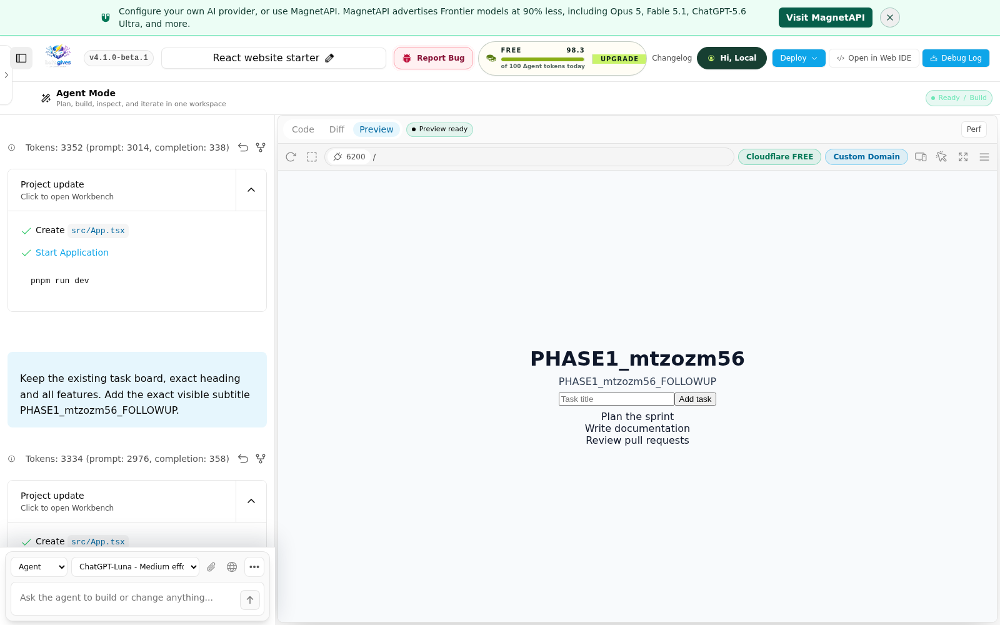
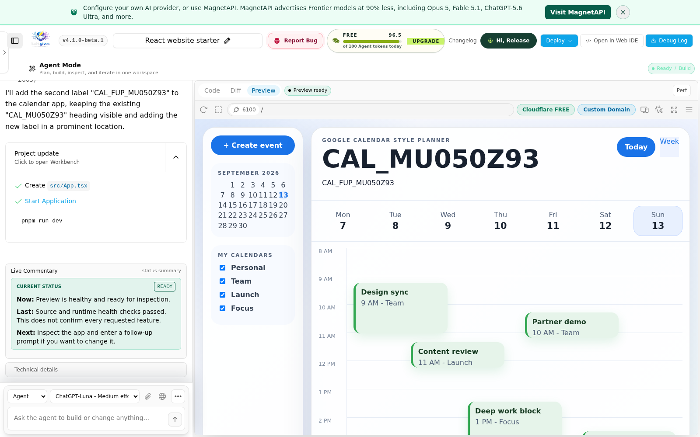
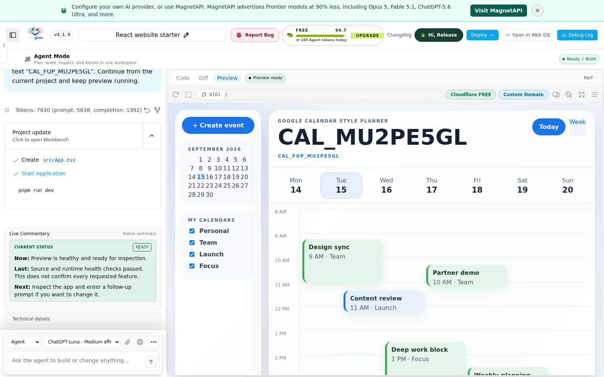

# bolt.gives

> **Looking for the commercial edition?** [WebCoder.Codes](https://webcoder.codes) is the commercial version of this project. Its team of 120+ developers is building a managed Agentic Coding experience for organizations that want commercial hosting, support, and product development beyond the open-source release.

[](https://github.com/embire2/bolt.gives/releases/tag/v4.1.3)
[](ROADMAP.md)
[](LICENSE)
[](.nvmrc)
[](package.json)

**bolt.gives is an open-source Agentic Coding platform that turns a plain-English request into a working, previewable web application.** It writes the files, installs dependencies, runs commands, starts the development server, checks that Preview is healthy, and keeps the prompt available for follow-up changes.

[Try bolt.gives](https://bolt.gives) | [Report a bug](https://github.com/embire2/bolt.gives/issues/new/choose) | [Share feedback](https://github.com/embire2/bolt.gives/discussions) | [Read the roadmap](ROADMAP.md)

> **Reliability first.** Each release is tested on the dedicated [alpha test instance](https://alpha.bolt.gives/chat) before production rollout. Alpha may contain unfinished changes: use disposable projects, not important data. See the [test environment guide](docs/operations/alpha-staging.md) and [actionable bug-fix queue](ROADMAP.md#next-patch-bug-fixes-only).

> **v4.1.3, 21 September 2026:** project databases now use a guided **Supabase-only** setup with free-registration links and server verification before credentials are saved. The history drawer and item actions remain opaque while opening and closing. The complete native Windows source now lives in [`desktop/windows`](desktop/windows), and **Desktop v1.11.0** adds the same native Supabase wizard while keeping Live CLI workspaces database-free. [Release notes](docs/releases/v4.1.3.md) describe this patch; [v4.1.2 notes](docs/releases/v4.1.2.md) cover the current GLM FREE model and account/fleet changes.

**What changed:** current, bounded source snapshots; reliable follow-up/history restoration; faster FREE startup without a separate paid probe; account-owned provider keys; protected public browsing; pricing and Checkout repairs; truthful database/payment status; accessible onboarding; and recoverable Linux/PowerShell installers. Code/Preview selection and the compact follow-up prompt remain stable during generation and repair.

Final acceptance also corrected shared registration throttling, Preview health checks during server restarts, isolated Preview redirect headers and HTTPS chat-stream completion. Chat transfers ownership to one bounded consumer; unused response branches are cancelled, not drained in the background. Admin status remains readable during fleet deployments, and hostile admin requests are rejected before page rendering on both direct and managed domains.

**The stuck-repair bug is reproduced and fixed.** A browser hook crash followed by a late successful HTML response could cancel repair and falsely report Ready while source was broken. That race now preserves Repairing, restores the last-good source, and then restores visible Preview. [Before/after evidence](docs/quality/2026-09-15-browser-recovery.md) distinguishes the injected browser error from real-provider generation. Intentional stop also no longer triggers an unwanted Preview restart.

**Validation policy:** release checks cover module boundaries, types, lint, unit/integration tests, production artifacts and browser bundle budgets. A real Chromium journey must generate files, load Preview, apply a follow-up to the same project, restore history and verify public publishing. Quota, authenticated provisioning and admin proxy/session regressions are tested separately. Recovery fixtures inject failures explicitly; they are not represented as real-provider generation. [Installer CI](https://github.com/embire2/bolt.gives/actions/workflows/installer-recovery.yml) covers clean/repair contracts; native Windows acceptance remains independent.

**v4.1.2 acceptance:** 1,531 tests passed, nine skipped; all six template Preview smokes passed. A real GLM Cloudflare browser journey completed generation, follow-up, history restore and publishing in 160 seconds. The published app remained available after its coding runtime stopped. [Evidence and remaining limits](docs/quality/2026-09-20-v4.1.2-acceptance.md).

Preview asset reads also survive a brief cleared-port handoff without bypassing ownership. Reopening a project waits for an in-progress runtime start rather than immediately rerunning setup. Idle-history acceptance verifies runtime readiness separately from chat-stream completion.

**Billing is active:** production Upgrade opens a USD 5 monthly Stripe subscription Checkout. The dedicated signed webhook is enabled; unsigned/tampered requests are rejected, replay is tested, and disposable PostgreSQL tests cover activation, renewal and duplicate events. The live test Checkout was expired without charging a card. A real paid transaction is reserved for the operator's acceptance test.

**Open-source installation and feedback:** try the Linux installer below, bring your own provider key, and [open an Issue](https://github.com/embire2/bolt.gives/issues/new/choose) with your version and reproduction steps. Generated projects start database-free and can connect a user-owned Supabase project when needed. The native Windows source and signed-release workflow are public; Windows/WSL server installation remains a separate path. Codeball is removed; required tests, builds and security scans remain.

## What You Can Do

Type a request such as:

> Build a responsive appointment booking app for a mobile dog groomer. Include services, available time slots, customer details, and a polished confirmation screen.

bolt.gives then:

1. Understands the request and carries the current project context into the run.
2. Creates or updates real source files instead of returning disconnected code snippets.
3. Runs dependency installation, builds, tests, and development commands in the managed runtime.
4. Opens the generated app in Preview only after the runtime can load it successfully.
5. Explains progress in plain English while technical command details remain available on demand.
6. Accepts follow-up prompts against the same files, history, runtime, and Preview.
7. Publishes supported static projects to a shareable Cloudflare-backed address.

The product rule is simple: **generated files are not a successful result; a health-verified Preview is.**

## Real Screenshots

These screenshots are captured from the actual application with Playwright. They are not design mockups.

### v4.1.2: GLM, saved history and a usable Preview

This 20 September capture shows the dedicated Cloudflare alpha after a real GLM
follow-up and saved-history reload. The 20-credit balance, compact composer,
current model and running Calendar are visible together. The same test published
the app and checked it independently of the coding runtime.



The earlier captures below show the evolution of v4, not the current FREE model.

### Start in plain English


### Choose how the agent should work

Select a hosted FREE model, ask for a direct build or a plan-first run, import an existing project, or connect data only when the application needs it.


### Build and continue in Agent Mode

Conversation, the compact follow-up prompt, Code, and Preview remain part of one project surface.

This calendar was generated from a normal English prompt in a real isolated Node.js runtime with no project database. Chromium waited for the generated files, development command, healthy Preview, and runtime snapshot before taking the screenshot.


The combined beta was tested with a real FREE/Luna task board, an interactive Add task control, a follow-up change, navigation, reload and runtime restart. This 13 September screenshot shows the restored follow-up in the isolated test environment, not a production deployment. The earlier checkpoint screenshot remains in the [historical evidence](docs/quality/2026-09-12-phase2-checkpoint.md).



The latest staging screenshot shows a real Cloudflare-assigned instance after a Calendar follow-up and saved-history restore. Its generated app was also published and exercised in a normal browser. It is staging evidence, not a screenshot of the current stable release.



This 15 September capture is **live production v4.1.0**, after a real FREE/Luna
follow-up and saved-history reload. The same journey published the application
and verified that its public page remains available after the coding runtime
stops. Both chat streams completed normally, with no fatal browser/network errors.



### Connect data only when the app needs it

Projects start without a database. The guided wizard can open free Supabase registration in a new tab, then verifies the user's Project URL and publishable/anon key before saving it privately.


## Agent Mode

Version 4 replaced separate, competing Chat and Workspace routes with one continuous project experience.

- A new project starts with a full prompt so the user can describe the outcome clearly.
- The first build moves into **Agent Mode** automatically.
- Desktop keeps the conversation and a small follow-up composer beside a dominant Code/Preview workspace.
- Mobile provides an explicit Agent/App switch while keeping the prompt available.
- Preview health changes do not force the user away from Code or make the page flash between states.
- The selected model can change during a project without discarding history.
- Recovery is bounded. The UI shows a stable repairing state instead of looping forever between Working and Needs Repair.

The hosted FREE model is **GLM 5.3 Flash**, using the verified OpenRouter ID [`z-ai/glm-5.3-flash`](https://openrouter.ai/z-ai/glm-5.3-flash). Each account receives **20 API credits per day**, approximately **20 minutes of active generation**, resetting at **00:00 GMT+2**. Idle editing is not charged. The funded key stays on the operator's server, never in this repository, generated projects or managed Cloudflare instances. When the allowance is exhausted, use your own provider key, upgrade, or wait for reset.

The separate **MagnetAPI** provider uses your own User API Key. Sign in at [MagnetAPI.org](https://magnetapi.org), buy a plan, create a key and enter it in bolt.gives. The dropdown includes ChatGPT-Luna, ChatGPT-5.6 Ultra, Opus 5, Sonnet 5 and Fable 5.1 compatibility labels, plus account-specific model discovery. Availability depends on the upstream account; personal requests never fall back to the operator-funded FREE key. MagnetAPI's advertised discount is its pricing claim, not a bolt.gives price guarantee.

## What Version 4 Includes

### Prompt to Preview

- A hosted Node.js/Linux runtime for files, commands, package installation, builds, tests, and development servers.
- Real Preview health checks before success is reported.
- Automatic recovery for common dependency, manifest, routing, Vite, and startup failures.
- First-party Appointment, Calendar, SaaS Dashboard, Marketing, Commerce, and Portfolio template packs with Chromium smoke coverage.
- Website browse-to-build support for prompts that reference an existing public website.

### Continue the Same Project

- Profile-scoped project history.
- Durable conversations and source snapshots.
- Stable runtime identity across reloads.
- Follow-up prompts that receive current project memory and the latest runtime files.
- Completed historical actions remain visible but are not executed again when a project reopens.

### Code and Preview Together

- File tree and editor.
- Integrated terminal output.
- Responsive, full-size Preview.
- Compact follow-up prompt in Agent Mode.
- Plain-English progress and expandable technical diagnostics.
- Runtime state that does not override the user's Code/Preview selection.

### Publish and Share

- GitHub and GitLab project export.
- Protected Cloudflare project deployment for configured hosts.
- FREE project subdomains under the operator's configured domain.
- Optional Custom Domain billing and entitlement hooks for operators that configure Stripe.
- Deployment health checks instead of optimistic success messages.

### Operate a Fleet

- Signed-in managed instance registration and account-owned assignment.
- One instance per account by default, with an operator on/off toggle in `/admin`.
- Admin access at `https://your-instance.example/admin`; protected backend authentication is retained.
- Release-SHA rollout guards.
- Health-verified refreshes and last-good rollback data.
- Tenant, profile, audit, mail, and deployment control-plane surfaces.
- Optional isolated runtime-node workspaces for operators that need dedicated Linux CLI access.

## Databases Are Optional

Generated applications no longer require a bolt.gives-managed PostgreSQL server. A normal project begins with no database and can build, Preview, save, restore, and publish without one.

The PostgreSQL database used by bolt.gives itself for profiles or operator data is separate. Self-hosters may enable that database, but it is not inherited by generated apps.

### Connect Supabase

1. In bolt.gives, open **Database**.
2. If needed, select **Register Supabase for Free**. Registration opens in a new tab so the project remains available.
3. Create or open a project and use its **Connect** dialog to find the Project URL and publishable key.
4. Return to the wizard, select **I have a Supabase account**, and paste the **Project URL** and **Publishable key** or legacy **anon key**.
5. Select **Verify and connect**. Restart an existing Preview to apply the new environment.

The runtime sends a bounded request to the project's REST endpoint and reports **verified** only when Supabase accepts the publishable key. It does not bypass Row Level Security or treat table access as a health requirement. Use **Replace credentials** for rotation; an unsuccessful replacement preserves the previous record. Restart Preview after replacement or disconnection because existing processes retain their old environment.

The runtime provides these variables to the project:

```text
VITE_SUPABASE_URL
VITE_SUPABASE_PUBLISHABLE_KEY
VITE_SUPABASE_ANON_KEY
SUPABASE_URL
SUPABASE_PUBLISHABLE_KEY
SUPABASE_ANON_KEY
```

Supabase publishable/anon keys are designed for client use, but Row Level Security still controls access. Enable RLS and write policies for every client-accessible table. Never use a Supabase service-role key in the quick-connect field.

New project database connections are Supabase-only. Existing private PostgreSQL records remain readable long enough to migrate a project safely, but the UI and API do not create or replace them. The optional PostgreSQL server used by some self-hosters for bolt.gives profile/admin data is separate and is never exposed to generated applications.

## How We Reached v4

bolt.gives began as a browser-focused AI code generator. The v3 release line turned it into a hosted coding system: project persistence, server-side model routing, managed runtimes, Preview recovery, profile-scoped history, Cloudflare publishing, fleet administration, and reproducible template tests were added in successive patches.

That work exposed a product problem: Chat and Workspace competed for the screen, recovery could move the user between views, and important follow-up controls became difficult to find. v3.5 focused on first-pass Preview reliability and lower browser overhead. v4 then unified the complete flow into Agent Mode and made verified Preview the completion contract.

`v4.0.1` corrected published-app favicon fallback. **v4.1.0** combines both reliability phases and the production runtime-isolation migration, retaining v4's Agent Mode while fixing source preservation, recovery, account safety, browsing, billing and installation.

The complete release record is in [CHANGELOG.md](CHANGELOG.md).

## v4.1.0 Reliability Work

**Make the existing workflow dependable before expanding it.** The [September audit](docs/quality/2026-09-12-v4.1-audit.md) combines six-module code tracing, isolated contract reproductions, 32 real-browser route visits, and hosted FREE project generation. It does not claim exhaustive coverage or error-free software.

| Original finding                                                                    | Implemented correction                                                                                               |
| ----------------------------------------------------------------------------------- | -------------------------------------------------------------------------------------------------------------------- |
| B01: Package caches and nested dependencies enter source snapshots, increasing work | Filter generated trees consistently and bound snapshot bytes, file counts, and reads; measure browser/transport cost |
| B02: Disk edits with unchanged file counts can return stale source                  | Reconcile revisions, changes, deletions, and renames; test follow-up context and restore against the latest source   |
| B03: `/pricing` returns HTTP 500                                                    | Repair the server-render boundary and verify direct navigation plus the real Upgrade/login/Checkout path             |
| B04: No-database self-host registration returns 503 behind mandatory onboarding     | Add an explicit supported self-host identity mode and run both no-db and platform-db clean-install journeys          |
| B05: Saved provider credentials survive logout                                      | Make credentials account-owned and test complete cleanup across logout, account switches, and browser tabs           |
| B06: Unreachable Supabase settings appear connected                                 | Distinguish saved settings from verified connection health; test failure, rotation, and Preview restart behavior     |
| B07: Short-window login controls cannot be reached by scrolling                     | Fix available-height scrolling and test phone keyboards, banners, and zoom                                           |
| B08: Keyboard focus escapes the onboarding dialog                                   | Add real focus containment, background inertness, and accessible error/focus handling                                |
| B09: Pricing can claim payment from a return-URL parameter                          | Display payment state from authenticated server records, never from the query string alone                           |
| B10: Commentary can remain Active when Preview is Ready                             | Use one event-derived state and remove generic filler; verify reload, recovery, and readable status text             |
| B11: Screenshot/version gates and stale E2E selectors miss broken journeys          | Make normal onboarding, first Preview, interaction, follow-up, restore, and browser-error checks mandatory           |
| B12: Browsing fallback has a weaker destination-validation policy                   | Unify safe network validation, redirect handling, limits, and test doubles across browse transports                  |

The first audit recorded a Code/Preview timeout and snapshot 502; these failures are retained in historical evidence, not counted as passes. The final web acceptance adds real source/follow-up/history checks, isolated Preview, rootless processes, public publishing, signed billing and deterministic browser-error recovery. Test evidence has grown from 1,167 to 1,462 passing tests.

[ROADMAP.md](ROADMAP.md) separates shipped corrections from remaining validation and follow-up work. Windows/WSL server reboot-resume, broader model/account matrices, future WinUI research and fleet-scale performance profiling remain open. New feature expansion stays secondary to measurable reliability.

Both implementation checkpoints are combined in v4.1.0. The production app/runtime migration is complete, and original source, private records and host configuration remain available for rollback. Paid Stripe acceptance remains an explicit operator test; no automated test charged a real card.

### Native Windows Client

**Desktop v1.11.0** is a C#/.NET 8 WPF application using native Windows controls for authentication, projects, Chat, Workspace, editing, terminal, Supabase setup, deployment, account state, and updates. WebView2 is restricted to generated-project Preview; the app does not wrap the bolt.gives website. The source, portable test suite, Inno Setup definition, and signed-release workflow are in [`desktop/windows`](desktop/windows).

The updater downloads only an exact versioned GitHub asset, checks size and SHA-256, verifies the pinned Authenticode chain, requests administrator approval, closes the old app, validates the installed version, and rolls back on failure. Desktop uses its own `desktop-v*` version line. Future WinUI/C++ research remains a roadmap item and must outperform the working native client before replacing it.

**Desktop v1.11.0 is the current mandatory native release. Desktop v2.0.0 remains a proposed WinUI research version**, independent of the web release line and not yet approved. The current WPF source is public; a future replacement will not ship until it proves native parity, trusted signing, migration, updater rollback, accessibility, and performance.

## Install on Ubuntu

The supported self-host target is Ubuntu 20.04 or newer. A current Ubuntu LTS release is recommended.

> **Database-free installation:** fresh installs create a private single-owner login without PostgreSQL or SMTP. Use `--with-postgres` only for optional platform profile/admin storage. Installer CI covers configuration and repair contracts; complete Windows/WSL reboot-resume remains separate acceptance work.

### Requirements

- A regular Linux user with `sudo` access. Do not run the installer as `root`.
- At least 4 GB RAM for the default production build.
- Outbound HTTPS access for GitHub, npm, model providers, and Playwright browser downloads.
- Optional app/admin DNS records if Caddy should provide public HTTPS.
- No PostgreSQL server unless local profile/admin persistence is required.

### Recommended Installer

Download and inspect the installer before running it:

```bash
curl -fsSL https://raw.githubusercontent.com/embire2/bolt.gives/main/install.sh -o install-bolt-gives.sh
less install-bolt-gives.sh
chmod +x install-bolt-gives.sh
./install-bolt-gives.sh
```

The installer:

- verifies Ubuntu and refuses root execution;
- installs Node.js 22 and pnpm 9.14.4;
- clones or safely updates `main` without overwriting a dirty checkout;
- creates `.env.local` with independent generated secrets and mode `0600`;
- installs dependencies and builds the production application;
- creates app, runtime, collaboration, and web-browsing systemd services;
- optionally configures Caddy and HTTPS;
- leaves PostgreSQL off by default.

Recovery is bounded and explicit: failed downloads/package commands retry; dependency repairs retain the frozen lockfile; failed builds restore previous build artifacts; invalid Caddy configuration is rolled back without forcibly restarting the shared proxy. Repairs never reset an existing PostgreSQL role's password or take over another role's database. A failed Git update leaves the current installation and private configuration in place. Already-running services are explicitly restarted after a successful update, and health checks use finite timeouts. Rerun the same command after correcting a reported prerequisite. Disk exhaustion, invalid credentials, conflicting local changes, DNS, and operating-system reboots cannot be safely repaired by pretending success.

### Windows PowerShell Setup

The public [install.ps1](install.ps1) installs the **open-source server in Ubuntu on WSL2**, not the separately versioned native Windows desktop application. The Desktop installer is published under the latest [`desktop-v*` release](https://github.com/embire2/bolt.gives/releases?q=desktop-v). The PowerShell script supports Windows PowerShell 5.1 and PowerShell 7. Review it in the validation checkout, then run:

```powershell
.\install.ps1 -CheckOnly
.\install.ps1 -InstallWsl
.\install.ps1
```

WSL installation requests administrator approval when needed. If a reboot or first-run Linux user setup is required, the script stops with instructions and can be rerun; it never silently restarts Windows or deletes a distribution. Ubuntu must use a non-root user with sudo and active systemd. See Microsoft's [WSL installation](https://learn.microsoft.com/en-us/windows/wsl/install) and [systemd configuration](https://learn.microsoft.com/en-us/windows/wsl/wsl-config#systemd-support) guidance. Downloads have bounded retries; nonzero Linux exit codes remain failures. No operator credentials are embedded.

PowerShell 5.1/7 and Ubuntu 22.04/24.04 clean/repair CI pass. Full Windows/WSL installation and reboot-resume remain unverified; treat Windows setup as a supported bootstrap path with that explicit acceptance limitation, not a newly released native desktop client.

### Single-Owner Mode

On a fresh database-free installation, the installer sets `BOLT_SELF_HOST_MODE=single-user` and generates `BOLT_SELF_HOST_ACCESS_TOKEN` in the protected `.env.local` file inside the installation directory (by default, `$HOME/bolt.gives`). Open that file privately on your server, enter the owner token in the browser's **Your private workspace** form, then select an AI provider and enter your own API key. Do not share or commit the owner token.

This is one private owner, not an unauthenticated multi-user service. The profile and hashed sessions survive runtime restarts in a mode-`0600` file outside project source. Repair installs preserve the token; explicitly rotating it invalidates prior sessions while retaining the owner identity. Runtime HTTP and Preview WebSocket requests pass through owner authentication. Keep the runtime listener private on loopback.

Existing platform-PostgreSQL installations are not silently converted to single-owner mode. New `--with-postgres` installs retain the hosted profile workflow. Generated projects remain database-free in either mode. A fresh self-host does not inherit the hosted FREE operator key, Stripe settings, SMTP credentials, or Cloudflare account.

To install optional PostgreSQL for bolt.gives profile/admin data:

```bash
./install-bolt-gives.sh --with-postgres
```

To configure public domains in one command:

```bash
./install-bolt-gives.sh \
  --app-domain code.example.com \
  --admin-domain admin.example.com \
  --letsencrypt-email ops@example.com
```

Useful options:

| Option            | Purpose                                                  |
| ----------------- | -------------------------------------------------------- |
| `--with-postgres` | Install local PostgreSQL for platform profile/admin data |
| `--skip-postgres` | Explicitly keep the database-free default                |
| `--skip-caddy`    | Run services without public Caddy configuration          |
| `--skip-build`    | Update source/configuration without rebuilding           |
| `--skip-service`  | Do not install or restart systemd units                  |
| `--branch NAME`   | Install a branch other than `main` for testing           |

After installation:

```bash
sudo systemctl status bolt-gives-app --no-pager
sudo systemctl status bolt-gives-runtime --no-pager
sudo systemctl status bolt-gives-collab --no-pager
sudo systemctl status bolt-gives-webbrowse --no-pager
```

Run the executable installer smoke before publishing installer changes:

```bash
pnpm smoke:self-host-installer
```

The detailed checklist is in [docs/fresh-install-checklist.md](docs/fresh-install-checklist.md).

## Developer Setup

### Outgoing Email

Profile sign-in and operator emails use the server-side `BOLT_ADMIN_SMTP_*`
settings documented in `.env.example`. Keep real credentials in your protected
service environment or ignored `.env.local`, never in source or Cloudflare
browser bindings. Port 587 uses STARTTLS, not implicit TLS; port 465 uses
implicit TLS. `BOLT_ADMIN_SMTP_FROM` is the sender email address,
`BOLT_ADMIN_SMTP_FROM_NAME` is its optional display name, and
`BOLT_ADMIN_SMTP_REPLY_TO` sets an optional default Reply-To across outgoing
messages. Sender-name and Reply-To support is included in v4.1.2.

If the admin panel has saved SMTP overrides, update those too: the protected
runtime settings file takes precedence over service environment values. Hosted
instances send email through their runtime; do not distribute an operator's
SMTP password to managed instances or generated projects.

### Local Development

```bash
git clone https://github.com/embire2/bolt.gives.git
cd bolt.gives
corepack enable
corepack prepare pnpm@9.14.4 --activate
pnpm install --frozen-lockfile
cp .env.example .env.local
pnpm dev
```

Use Node 22.22.0 from [.nvmrc](.nvmrc). Keep real credentials only in ignored `.env.local` files or a platform secret store. Never put them in `.env.example`, screenshots, logs, generated projects, or commits.

Self-hosters can configure their own supported model provider in Settings. The hosted FREE provider and its quota are server-side services operated by the public deployment; cloning this repository does not grant access to private hosted credentials.

## Six Modules, One Build

The source is split into six ownership modules so most changes touch only one or two domains:

| Package               | Responsibility                                                                  |
| --------------------- | ------------------------------------------------------------------------------- |
| `@bolt/core`          | Shared contracts, paths, security, logging, URLs, and low-level utilities       |
| `@bolt/agent`         | Providers, prompts, context, streams, tools, commentary, browsing, and recovery |
| `@bolt/runtime`       | Hosted commands, workspace sync, Preview lifecycle, health, and isolation       |
| `@bolt/project`       | Files, history, Workbench, editor, terminal, actions, and integrations          |
| `@bolt/control-plane` | Profiles, tenants, instances, updates, publishing, billing, mail, and audit     |
| `@bolt/surfaces`      | Remix routes, application chrome, Cloudflare adapters, and orchestration        |

Read [docs/architecture/modules.md](docs/architecture/modules.md), [AGENTS.md](AGENTS.md), and the nearest module `AGENTS.md` before making a cross-module change.

## Validate a Change

Use the smallest module check while developing:

```bash
pnpm module:list
pnpm module:check runtime
pnpm module:affected
```

Before a code change is released:

```bash
pnpm check:boundaries:strict
pnpm typecheck
pnpm lint
pnpm test
pnpm build
```

Cross-boundary behavior also needs its relevant browser or service smoke. A prompt-to-preview E2E is complete only when a normal browser creates files, reaches a healthy Preview, applies a follow-up change to the same project, and reloads with history intact.

Refresh README screenshots with:

```bash
./scripts/capture-screenshots.sh
```

## Test It and Tell Us What Breaks

The project needs testing on VPS providers, network configurations, browsers, generated frameworks, and application ideas that maintainers will not discover alone.

1. Install `main` on an Ubuntu test server.
2. Create a real application from a normal English prompt.
3. Wait for the health-verified Preview.
4. Ask for a follow-up change.
5. Reload and reopen the project from history.
6. Try the Supabase wizard or continue with no database at all.
7. Publish if your Cloudflare integration is configured.

Open a [bug report](https://github.com/embire2/bolt.gives/issues/new/choose) with the route, selected provider/model, exact visible error, final command exit code, Preview health reason, browser console output, and redacted service logs. Never attach credentials or customer data.

Use [GitHub Discussions](https://github.com/embire2/bolt.gives/discussions) for product feedback, installation reports, template ideas, and roadmap proposals. A reproducible report with a small test project is more useful than a broad statement that generation failed.

## Contributing

Contributions are welcome from first-time and experienced open-source developers.

1. Read [CONTRIBUTING.md](CONTRIBUTING.md) and choose an existing Issue or a focused roadmap item.
2. Comment on the Issue before starting a large change so work is not duplicated.
3. Fork the repository and branch from `main`.
4. Fix the smallest owning module and add a regression test.
5. Run the affected module check and the full required gates.
6. Open a pull request explaining the user problem, root cause, solution, and verification evidence.

Good first contributions include installer portability reports, accessible UI fixes, template smoke coverage, provider schema tests, Preview recovery reproductions, documentation corrections, and browser bundle reductions.

## Security

Do not report vulnerabilities in a public Issue. Follow the repository's private security-reporting path where available, and never include production credentials, session cookies, database URLs, SSH material, or customer data in a report.

Generated code and model output are untrusted. v4.1.0 addresses the [audit's](docs/quality/2026-09-12-v4.1-audit.md) snapshot-filtering, credential-lifecycle and browse-validation findings. Hosted production additionally uses rootless project containers and separate signed HTTPS Preview origins. These controls and their tests reduce risk; they are not a claim that arbitrary generated code is safe or that no undiscovered bugs remain.

## License

[MIT](LICENSE)
