<p align="center">
  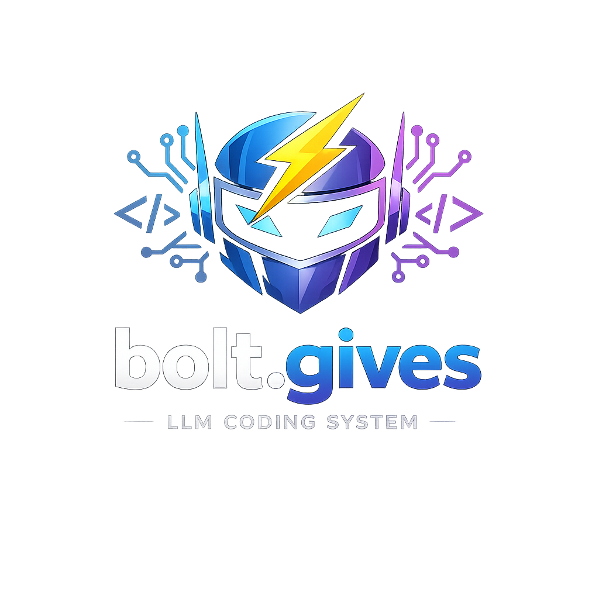
</p>

<p align="center">
  collaborative, open-source ai coding workspace
</p>

<p align="center">
  <a href="https://bolt.gives">
    
  </a>
</p>

<p align="center">
  <a href="https://alpha1.bolt.gives">live alpha</a> ·
  <a href="https://create.bolt.gives">create a managed instance</a> ·
  <a href="https://bolt.gives/pricing">Custom Domain pricing</a> ·
  <a href="https://github.com/embire2/bolt.gives">contribute on GitHub</a> ·
  <a href="docs/architecture/modules.md">architecture</a> ·
  <a href="CHANGELOG.md">changelog</a> ·
  <a href="ROADMAP.md">roadmap</a> ·
  <a href="#installation-ubuntu-1804-only-verbose-tested">install</a>
</p>

## Start Here

- [Create a managed Cloudflare instance](https://create.bolt.gives)
- [Compare FREE and Custom Domain](https://bolt.gives/pricing)
- [Download the hosted Desktop client](https://github.com/embire2/bolt.gives/releases/tag/v3.4.2)
- [Create a live Ubuntu CLI workspace](/workspace-setup)
- [Contribute through GitHub](https://github.com/embire2/bolt.gives)
- [Understand the six-module architecture](docs/architecture/modules.md)
- [Open the live alpha environment](https://alpha1.bolt.gives)
- [Review the roadmap](ROADMAP.md)
- [Read the changelog](CHANGELOG.md)

`create.bolt.gives` lands on the public `/managed-instances` registration flow. Users complete a short profile, including email address, request a preferred subdomain, and then receive a success page showing the live URL, assigned hostname, availability, and rollout state for the managed instance. The create flow is tuned for high-contrast readability so the public registration surface remains usable without theme tweaking. Those profile details are stored privately in the operator panel so admins can support and message clients when needed.

Managed instances serve their runtime preview through their own assigned hostname. The Pages deployment proxies `/runtime/*` to the hosted runtime control plane while preserving the instance origin, so users preview locally hosted workspace output at `https://<assigned-instance>/runtime/preview/...` and can publish publicly only when they choose to deploy.

Managed Pages instances also use `https://bolt.gives` as the canonical hosted `FREE` relay/control origin, so new trial instances do not inherit the older alpha host defaults.

Cloudflare Pages edge functions also retry runtime-control calls through `https://bolt.gives/runtime` when the edge rejects the local loopback fallback, which keeps public Pages previews from surfacing avoidable runtime-control console errors.

The new [`/workspace-setup`](/workspace-setup) wizard provisions dedicated Ubuntu runtime-node projects for clients who need a real server CLI. Each project gets its own Linux user, private workspace directory, PostgreSQL database/user/password, and SSH command. Runtime-node admin SSH credentials stay in ignored env/runtime service files and are never sent to the browser.

The public homepage at [`https://bolt.gives`](https://bolt.gives) is the project website. It highlights the current release, managed-instance flow, GitHub contribution path, real product screenshots, crawler-friendly structured data, and a generated search/social image at `/seo/bolt-gives-agentic-coding-platform.png`. The coding workspace is available at [`https://bolt.gives/chat`](https://bolt.gives/chat) and existing project chats continue to load at `/chat/:id`.

## Contribution Pathway

`bolt.gives` is open source and accepts contributions through the public GitHub workflow at [`https://github.com/embire2/bolt.gives`](https://github.com/embire2/bolt.gives). The old public application form has been retired to stop automated spam; `/contribute` no longer collects names, email addresses, GitHub usernames, or private contributor applications.

- Open or comment on an issue before starting broad work.
- Keep pull requests focused and include the behavior, tests, and deployment impact.
- Prioritize prompt-to-preview reliability, managed deployments, templates, self-hosting, documentation, and visible execution.
- Never include secrets, API keys, cookies, private logs, or customer data in issues or pull requests.

Contributors can pick up roadmap-aligned issues and help improve prompt-to-preview reliability, managed deployments, templates, self-hosting, documentation, and the visible execution experience.

## Current Release (`v3.4.2`)

`v3.4.2` makes personal projects account-aware, recalibrates the FREE allowance to provide at least 30 active coding minutes per GMT+2 day, closes the Stripe account-upgrade loop, hardens Linux installation, and introduces separately distributed Desktop clients for Windows, Debian/Ubuntu, and AppImage-based Linux systems.

### v3.4.2 personal history, usable FREE time, and account billing

- Sidebar history, direct project loading, snapshots reached through chats, rename, delete, duplicate, fork, import, and export are scoped to the authenticated profile. Guest projects remain guest-only instead of appearing under whichever account signs in next on a shared browser.
- The FREE balance remains 100 Agent tokens per day, but those tokens are now time-calibrated: 100 tokens cover at least 30 minutes of active generation. The runtime still records raw provider usage separately for operational accounting.
- Every Upgrade button starts authenticated, server-created Stripe Checkout. Payment state is activated only by a signed Stripe webhook; monthly renewal resets the 10,000-token allowance, usage writes are idempotent, and one active subscription can be attached to one published Custom Domain project.
- Planning and template calls through `/api/llmcall` honor paid account balances, so a Custom Domain customer cannot be stopped by the FREE daily allowance during the same coding session.
- The self-host installer generates separate relay, quota, profile, admin-cookie, and billing secrets, writes runtime-control configuration, validates partial Stripe setup, and protects `.env.local` with `0600` permissions.
- The compiled bolt.gives Desktop client loads the hosted workspace with hardened Electron isolation and the same profile-backed 100-token FREE plan. Desktop source is private and is not part of this MIT-licensed repository; release binaries contain no hosted-provider or Stripe secret.

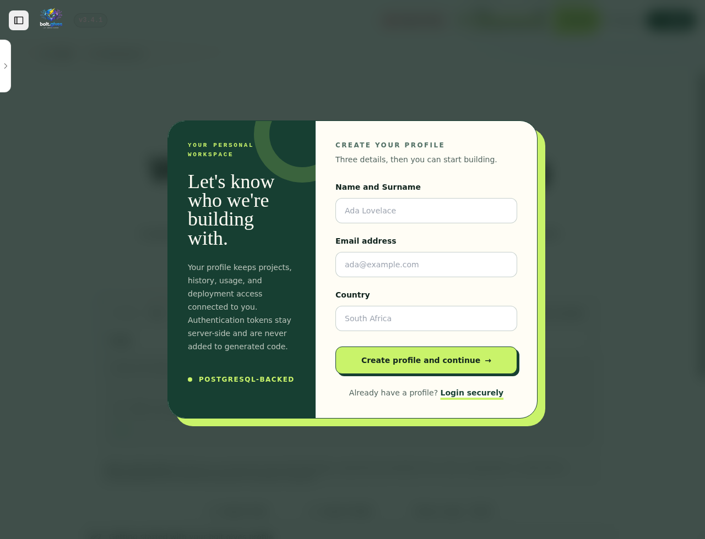

### v3.4.1 profiles, token balances, and Custom Domain release

- First-time visitors create a profile with name and surname, email address, and country. Profiles, opaque session hashes, one-time login-link hashes, expiry, and revocation state are stored in PostgreSQL; plaintext login tokens are never stored.
- Returning users use the new top-menu `Login` button and an emailed one-time link. New chats greet signed-in users with `Hi {Name}, what are we creating today?`.
- The header shows an actual Agent-token balance with a progress meter. Hosted `FREE` includes 100 Agent tokens each day, resetting at `00:00 GMT+2`.
- When the FREE allocation is exhausted, a paused-service modal explains the reset and offers the `Custom Domain` launch promotion or continued use with a personal provider key.
- `Custom Domain` replaces the old Premium wording. Its launch price is `$5/month` per project, a `$20/month` value, and includes 10,000 Agent tokens, Deep Build orchestration, custom-domain hosting, priority recovery, Preview verification, and deployment health checks.
- Custom Domain runs are preflighted before generation and charged only from actual provider-reported token usage afterward. Completion retries are idempotent and cannot double-record the same run.
- The Deploy dropdown now has a solid white background and dark option text in every theme. The project title has a reserved, flexible center column so surrounding controls cannot cover it.
- Operator-only Admin Panel and former WebCoder menu links are removed from the public header. `/premium` remains only as a compatibility redirect to `/pricing`.
- The self-host installer now ships the previously missing `.env.example`, generates an independent profile-cookie secret, and keeps PostgreSQL profile setup aligned with the normal installation path.

### v3.4.0 deployment and custom-domain foundation

- `Deploy to GitHub` now waits for its asynchronous deployment artifact before reading `runner`; GitLab, Netlify, and Vercel received the same preventative fix. Hosted GitHub/GitLab preparation builds and exports the authoritative server workspace rather than stalling on a dormant browser WebContainer.
- TypeScript Vite starters include their required Node typings. If an older hosted project is missing only that dependency, repository deployment repairs it once and reruns the production build before opening the GitHub/GitLab dialog.
- `Deploy to Cloudflare` builds and stages the generated project server-side, excludes secrets and dependency trees, uploads through the protected Cloudflare account used by `create.bolt.gives`, and returns a health-verified Pages URL.
- `Deploy to OpenWeb.Software (FREE)` publishes the current hosted project to a shareable `https://{subdomain}.bolt.gives` address.
- The payment-verified custom-domain foundation includes Stripe webhook verification, DNS validation, Caddy activation, and entitlement state. `v3.4.1` now presents this as Custom Domain with actual Agent-token accounting and monthly billing.
- Stripe fulfillment verifies the raw-body signature, processes events idempotently, activates access only after payment, resets tokens after successful renewals, and handles failed, updated, and canceled subscriptions.
- Billing secrets stay behind the hosted server boundary. The public repository contains the integration contracts and transparent entitlement rules, not operator credentials or model-provider secrets.

The open-source core remains available under `bolt.gives`; hosted Custom Domain services use authenticated server APIs without shipping private credentials in this public repository.

### v3.3.1 web and Linux release

- Removed the legacy Electron main/preload implementation, build scripts, packaging assets, updater/notarization configuration, direct dependencies, TypeScript coupling, and GitHub release workflow.
- Removed obsolete Electron download workarounds from web CI so normal install, quality, Pages, and release jobs use only the dependencies they need.
- Added regression coverage that fails if Electron scripts, dependencies, source, packaging configuration, or tag workflow return.
- GitHub releases continue to provide the supported Linux installer; `v3.3.1` does not include an Electron or Windows desktop binary.

We are working on a brand-new native Windows application as a future paid offering. It will use a separate architecture, installer, update channel, security review, and release process rather than carrying forward the retired Electron code.

### v3.3.0 modular workspace architecture

- Production ownership is explicit across `core`, `agent`, `runtime`, `project`, `control-plane`, and `surfaces`.
- Shared file contracts, workspace paths, diffing, project command detection, and artifact path normalization live in `@bolt/core`, removing circular feature dependencies.
- Runtime-node/Preview helpers, collaboration, web browsing, admin mail/data, publishing, and managed-instance services now live beside their owning module. Stable `scripts/*` facades preserve existing systemd and self-host commands.
- Every module has an independent TypeScript, lint, and Vitest task. Turborepo coordinates the graph, and `pnpm module:affected` checks a changed module plus all transitive consumers.
- `pnpm check:boundaries:strict` rejects undeclared module dependencies, new source files above 1,000 lines, and growth in explicitly tracked legacy hotspots.
- The migration is behavior-preserving: the full 1,029-test suite and the production bundle gate validate the unified build output.
- Health checks report the compiled release version, preventing stale Cloudflare environment metadata from mislabeling a newly deployed build.
- Deterministic first-party starters always continue through the selected hosted FREE model once Preview is healthy. Starter-only history defers route navigation so Chat cannot remount and lose its pending request; interrupted sessions reconstruct that request from persisted messages. Successful runtime bootstrap schedules continuation directly, and verified Preview readiness overrides stale client state. The strict Calendar E2E requires both the rendered app and a successful model request.
- Production Pages deployment uses the repository-pinned Wrangler CLI and smoke-tests the exact immutable URL returned by Cloudflare, avoiding false release failures from the deprecated Pages Action reporting a different `404` hostname.

See [Module Architecture](docs/architecture/modules.md) for ownership, dependency rules, and focused development commands.

### v3.2.0 project continuity and preview reliability

The v3.2.0 release closes a false repair loop found by exercising the hosted FREE ChatGPT-5.6 SOL path in a real browser. A healthy, request-scoped preview now finalizes successfully when the absolute FREE deadline closes a late provider stream after the app is ready; that expected closure no longer appears as `Network error`, `BOLT_STREAM_TIMEOUT`, an error event, or a new hidden repair attempt.

Execution state is derived from ordered command starts and completions rather than the existence of any historical start event. Workspace therefore settles on `Preview ready` when the runtime is healthy instead of remaining stuck on `Working`, and an active repair stays a calm `Working` state until it finishes rather than flashing between states.

Hosted workspace delivery is now idempotent across the server-first and browser action paths. Re-sending the same file snapshot does not invalidate a healthy Preview, and a repeated unchanged start command reuses the verified Vite process instead of killing and relaunching it. Superseded recovery commentary is labelled as historical while the current footer settles on `complete`, `Preview ready`, and `verified`.

Hosted start actions defer process ownership to the runtime instead of issuing a browser-triggered `pkill` first. This lets the server's health and command-signature checks reuse an unchanged Vite process, eliminating the brief repair flash and revision churn previously caused by redundant follow-up handoffs.

Streamed browser file actions are delivered in debounced non-pruning batches between command boundaries, then reconciled with one authoritative full snapshot immediately before install/start. A partially rendered action stream can no longer prune previously generated files or start Vite without `index.html`, reducing runtime requests and eliminating a timing-dependent starter failure.

Queued automatic repair also settles immediately when the runtime's strict root-and-entry-module probe verifies the current app. A transient process exit can therefore restart cleanly without leaving a healthy project permanently labelled `Needs repair` or `Working`.

Follow-up file batches now advance a server-owned Preview revision that survives any required Vite process restart and reaches the browser after the updated app passes health verification. The existing iframe reloads once for that completed revision, so users see their improvement without HMR websocket noise, a stale app, or repeated per-file flashing.

The browser no longer creates speculative revisions immediately after a file sync. Initial loads, follow-up refreshes, and repair handoffs wait for the server's health-verified revision, and every handoff response carries the same cross-origin isolation headers as the generated app. Startup uses a bounded strict-health window instead of killing Vite on its first transient compile response. Same-session assets receive a 30.2-second ownership-handoff window while synchronized files settle. If Vite exits during runtime preparation, the project keeps its private port assignment while automatic recovery starts the replacement process; requests for any other session's port still fail closed. One revision-scoped blank-frame reload remains as a final browser fallback. This removes transient blocked-response failures while preserving the stable Preview frame.

Recoverable FREE stream disconnects are shown as automatic continuation activity rather than fatal request failures. If the continuation succeeds, Chat clears the recovery state and leaves the user with the healthy app instead of stale `Network error` text.

FREE model availability checks now follow the same MagnetAPI transport split as generation: ChatGPT-5.6 SOL uses `/v1/responses`, while Opus 4.8, Sonnet 5, and Fable 5 use the Claude-compatible `/v1/messages` contract. A Claude model can no longer be rejected by a preflight sent to the wrong API family.

If Magnet returns an upstream Claude outage containing generic API-key guidance, bolt.gives preserves it as a retryable hosted-provider failure rather than telling the user their instance is missing a key. Request and init headers are merged before translating Anthropic's `x-api-key` header to Magnet's bearer contract.

Plain-English commentary is emitted at least every 10 seconds during active work. Heartbeats are marked separately from real model/file/runtime progress so they keep users informed without preventing stall detection and recovery. The hosted browser E2E now requires a healthy final runtime, an idle follow-up prompt, generated and follow-up content in the same project, and no visible or console-level stream/repair errors.

The E2E also verifies the provider and model carried by the real `/api/chat` requests. A run cannot pass as a ChatGPT-5.6 SOL test if provider bootstrap silently selects another configured provider.

CodeQL uses one `javascript-typescript` v4 analysis, reducing CI bandwidth and hosted-runner pressure without weakening JavaScript or TypeScript coverage. The later `v3.3.1` cleanup removes the unused Electron runtime and its CI download workaround entirely.

Production Pages releases also wait for Cloudflare's immutable deployment URL to serve the expected application shell before the workflow passes. A short edge-propagation window can no longer turn a successful upload into a false release failure.

Wrangler runtime-home coverage supplies its own XDG directories rather than inheriting machine-specific runner defaults, so the same isolation contract is tested locally and in GitHub Actions.

Saved projects now preserve one coherent identity across chat history, source snapshots, hosted runtime files, Preview, and the project database. Selecting a project in sidebar history restores the complete visible conversation and source snapshot, then reconnects the original hosted runtime session through a read-only health check so follow-up prompts continue against the same app instead of a blank chat or a new workspace. Healthy saved Previews reopen without rerunning setup/start commands. Historical file, shell, and start actions remain visible as completed transcript entries but are not executed again, and historical command events remain available in Workspace without automatically hiding the restored Chat surface.

Every hosted chat-created project also receives its own PostgreSQL role and database on the configured runtime node. The runtime server opens an isolated SSH tunnel and injects `DATABASE_URL` plus standard `PG*` variables only into that project's server-side shell/build/preview processes. Database passwords remain in private runtime service memory and runtime-node `.env` files; they are not written into generated browser source, IndexedDB, API responses, screenshots, or managed Pages payloads.

The header Shout Out Box has been removed. `Report Bug` now opens the public [bolt.gives GitHub Issues page](https://github.com/embire2/bolt.gives/issues), keeping bug discussion and contributor feedback in the open-source project workflow.

### v3.1.0 highlights

- Protected `FREE` coding now offers ChatGPT-5.6 SOL through MagnetAPI.org's OpenAI-compatible Responses API and Opus 4.8, Sonnet 5, and Fable 5 through its Claude-compatible Messages API, without exposing the operator token to browsers or managed Pages projects.
- The FREE model switcher stays visible in Chat and the compact Workspace composer. A change applies to the next prompt while preserving the current conversation, project memory, files, preview, and runtime workspace.
- Magnet Claude follow-ups send compact exact replacements for existing files; bolt.gives reconstructs and validates the complete file server-side before applying it, preventing large source files from exhausting the model response limit and entering avoidable repair loops.
- Initial `/chat` assets fell from 2,754,764 bytes across 136 files to 1,658,074 bytes across 73 files, about 40% fewer bytes and 46% fewer initial requests.
- Settings integrations, plugins, PDF export, Git cloning, and terminal assets load only when requested; `Chat.client` fell from about 678 KB to 293 KB.
- Health, notification, and locked-file state perform less idle work, use event-driven updates where possible, and persist acknowledged connection states.
- `pnpm run build` now enforces a 1 MB per-asset and 2 MB initial-route budget under a 3 GB heap ceiling.
- Live release smoke targets the real `/chat` surface, requires generated and follow-up tokens in the same hosted runtime snapshot, and fails on fatal browser transport errors.
- Static requests use the Pages `ASSETS` binding before Remix SSR; real files keep their asset-server response while missing generated-preview assets receive lightweight `404` responses. The local Pages app worker defaults to a 1.5 GB heap with quiet Wrangler diagnostics.
- Concurrent hosted projects reserve unique preview ports before asynchronous socket checks, and preview plus published-project HTTP/WebSocket proxies verify session ownership, preventing one user's workspace from ever rendering another user's app.
- Follow-up prompts accepted during an active run dispatch once the run becomes idle even while preview/status updates continue rerendering the workspace; the queue no longer starves behind a repeatedly reset timer.
- A healthy preview from the previous run no longer cancels the next follow-up after its quiet-period unlock timer; preview completion is scoped to the request that produced it.
- Hosted FREE recovery is provider-aware: FREE requests enter single-flight continuation after 120 seconds without meaningful progress, while BYOK GPT-5/Codex models retain their longer thinking allowance.
- The browser also honors the server-advertised 150-second absolute FREE deadline with a one-shot response timer that is independent of stream rerenders, ensuring commentary or reasoning-only text cannot suppress recovery indefinitely.
- A hosted FREE build that completes with no file action and no workspace change is treated as incomplete and continued automatically; an empty HTTP 200 or a health check of the unchanged preview no longer strands a follow-up prompt.
- Follow-up validation is request-scoped: a prior assistant artifact cannot satisfy a later empty response.
- MagnetAPI availability is checked before Chat spends work on a hosted FREE run. An exhausted operator wallet produces a non-retryable hosted-funding notice rather than a generic error or a loop of hidden continuations.
- Collaboration documents are isolated by runtime project and file path, so users editing common paths such as `/src/App.tsx` cannot collide with another project’s Yjs state.
- Hosted preview reconciliation no longer treats an unreadable cross-origin location or an in-flight `about:blank` document as a failed iframe. Healthy previews remain mounted instead of flashing, aborting repeated requests, and consuming avoidable browser/runtime resources.
- Hidden recovery requests use single-flight dispatch, reducing duplicate model streams and avoiding the CPU, network, and provider usage caused by continuation rerenders.
- Commentary remains visible during long runs without masking provider stalls. Hosted FREE requests enter recovery after 120 seconds without visible/actionable model output and have a Cloudflare-lifecycle-safe 150-second response deadline that cancels stalled upstream work before single-flight continuation; BYOK long-thinking models keep their longer timeout.
- Operators can temporarily lower that FREE response cap with the server-only `BOLT_FREE_STREAM_MAX_DURATION_MS` setting (minimum 10 seconds) for staging diagnostics; it is never read from browser input.
- Automatic managed-instance rollouts yield to active coding sessions and run with deployment-specific resource limits; browser release smokes close their preview subscriptions before tearing down the generated runtime process so cleanup does not emit false transport errors.

### Quiet hosted Vite previews

`v3.0.9.32` disables Vite HMR inside hosted preview configs for generated apps. The Preview iframe still loads and refreshes through the runtime, but Cloudflare Pages-hosted previews no longer repeatedly log websocket `502` transport errors for an HMR channel that hosted users do not need.

### Stricter preview recovery

`v3.0.9.31` probes the Vite entry module graph after the root HTML shell before marking a hosted preview healthy. This catches failures where `/` returns a normal Vite shell but `/src/main.tsx` exposes a transform error such as unterminated JSX. Automatic restore now uses that stricter probe before telling users the preview recovered.

### Calmer coding preview

`v3.0.9.30` keeps the Preview iframe mounted while normal hosted runtime file-revision metadata changes. The preview can still reload when the user clicks reload, navigates to a different preview path, or when automatic repair needs to recover a blocked or restored frame, but ordinary coding updates no longer throw away the iframe and replace it on each revision.

### Pages preview checkpoint fix

`v3.0.9.29` normalizes every hosted preview checkpoint, command-ready preview, preview-status payload, preview-event payload, and Workbench preview sync to the current browser origin when the URL points at `/runtime/preview/...`. On `bolt-gives.pages.dev`, generated app previews now stay at `https://bolt-gives.pages.dev/runtime/preview/...` even if the central runtime control plane reports `https://bolt.gives/runtime/preview/...`.

### Empty-context first-pass fix

Brand-new projects often start with no useful files yet. `v3.0.9.28` lets chat generation continue with an empty context buffer when there are no workspace files or when context selection intentionally chooses no files. This prevents the chat stream from failing with `Bolt failed to select files` before the model can scaffold the app.

### First-pass project recovery

If a model tries to run `pnpm install`, `npm run`, or another package-manager command before emitting `package.json`, the hosted runtime still refuses the unsafe empty-workspace command. `v3.0.9.27` classifies that refusal as recoverable Architect work for hosted `FREE`: the model is instructed to retry the original request by emitting complete file actions for `package.json`, `index.html`, source files, and CSS before any install/build/test/start shell command.

### Canonical Pages preview fix

`v3.0.9.26` changed `bolt-gives.pages.dev` to use its own same-origin `/runtime` proxy for hosted runtime sync, status, command, and preview URLs. The Pages function still forwards those requests to the central runtime control plane and preserves `x-bolt-public-origin`, but the browser sees preview iframes at `https://bolt-gives.pages.dev/runtime/preview/...` instead of cross-origin `https://bolt.gives/runtime/preview/...`. This keeps Cloudflare Pages preview iframes compatible with the platform security headers instead of failing with browser blocked-response errors.

### Blocked shell mutation recovery

Project file writes must be emitted as complete file actions, not terminal redirection. `v3.0.9.25` detects `Blocked Shell Mutation` terminal errors as recoverable Architect issues, keeps the shell safety guard in place, and automatically retries hosted `FREE` runs with explicit instructions to re-emit the same changes through `<codyAction type="file">` or `<boltAction type="file">` blocks. Hosted `FREE`, small-model, optimized, and base artifact prompts now forbid `echo >`, `cat >`, `tee`, `sed -i`, and inline file-writing scripts for project files.

### Project publishing and custom domains

From the hosted Preview toolbar, users can publish the current project to a free bolt.gives subdomain such as `https://acme-dashboard.bolt.gives`. The runtime control plane records the deployment, attempts to create/update the Cloudflare A record, attempts to add a Caddy route, waits for HTTPS readiness, and keeps explicit DNS/routing status for operators.

Users who want their own domain select `Custom Domain` from Preview. bolt.gives creates a server-side Stripe Checkout subscription at the `$5/month` launch price, advertised as a `$20/month` value. Verified Stripe webhooks activate Custom Domain and the 10,000-Agent-token allowance; users then create an `A` record for their domain pointing at the configured bolt.gives server IP and rerun domain verification.

Required server-side env:

```bash
BOLT_PROJECT_DOMAIN_ROOT=bolt.gives
BOLT_PROJECT_PUBLIC_IP=31.6.62.180
BOLT_PROJECT_CADDY_ENABLED=true
BOLT_PROJECT_CADDY_SNIPPET_DIR=/etc/caddy/bolt-gives-projects
BOLT_STRIPE_PUBLISHABLE_KEY=pk_live_...
BOLT_STRIPE_SECRET_KEY=sk_live_...
BOLT_STRIPE_WEBHOOK_SECRET=whsec_...
BOLT_STRIPE_CUSTOM_DOMAIN_PRICE_USD=5
BOLT_CUSTOM_DOMAIN_TOKEN_ALLOWANCE=10000
BOLT_PREMIUM_INTERNAL_SECRET=<random-server-only-secret>
BOLT_FREE_DAILY_TOKEN_LIMIT=100
BOLT_PROFILE_COOKIE_SECRET=<independent-random-cookie-secret>
```

Keep the Stripe secret, webhook secret, token-metering secret, and profile-cookie secret in ignored server env files only. Do not commit them or expose them through Pages assets, generated projects, managed customer payloads, screenshots, or browser configuration.

The full prompt experience is preserved in `Chat`. Provider/model controls, attachments, web research, prompt enhancement, speech, mode toggles, save/resume/share, and the built-in web research note all remain available there. Google Calendar-style prompts now start from a deterministic React/CSS Calendar Planner with a week grid, agenda panel, create-event action, and any explicit visible heading text requested by the user.

### v3.1.0 preview/code reliability

`v3.1.0` tightens first-pass project creation and Workspace usability. `Preview` and `Code` now take priority over supporting panels: focused views collapse repair/working state into a small status chip, remove the large Workspace Activity drawer from the bottom of the work surface, and keep the compact follow-up prompt visible for guidance.

Workbench tab selection is user-respecting. The app may still auto-open `Preview` the first time a preview becomes available, but after a user clicks `Code` or `Diff`, runtime preview refreshes and repair-loop status updates no longer force the workbench back to `Preview`.

Google Calendar-style prompts now use a deterministic first-party Calendar Planner starter before model continuation. It is plain React/CSS with a week grid, agenda panel, calendar list, and create-event action, avoiding dependency-heavy first-pass failures such as fragile FullCalendar CSS subpath imports.

### Dedicated runtime-node Live Workspaces

`/workspace-setup` creates real project workspaces on an operator-configured Ubuntu runtime node. The runtime server connects to the node over SSH from the server side only, provisions PostgreSQL if needed, creates one Linux user per project, locks the workspace directory to that user, creates a project-specific PostgreSQL role/database, and returns one-time client credentials. Normal hosted chat projects use the same isolation automatically and receive their database through a server-only SSH tunnel whenever project commands or Preview run.

Configure it with ignored env/runtime service variables:

```bash
BOLT_RUNTIME_NODE_ENABLED=true
BOLT_RUNTIME_NODE_HOST=31.6.62.183
BOLT_RUNTIME_NODE_PUBLIC_HOST=31.6.62.183
BOLT_RUNTIME_NODE_PORT=22
BOLT_RUNTIME_NODE_ADMIN_USER=bolt-runtime-agent
BOLT_RUNTIME_NODE_SSH_KEY_PATH=/etc/bolt-gives/runtime-node-agent
BOLT_RUNTIME_NODE_BASE_DIR=/srv/bolt-live-workspaces
```

Use root/password only for the first bootstrap or an approved emergency repair. The steady-state path is a non-root runtime agent with an SSH key and server-side `sudo`; no root/admin SSH secret is sent to the browser or written into managed customer projects. If a bootstrap password was pasted during setup, rotate it after the agent key is verified.

### Built-in web app updater

Self-hosted Node/systemd deployments include a built-in updater at `/api/update`. When a newer GitHub Release is available, a banner appears at the top of every page with an `Update Now` button. The user is told the instance will automatically update to the target version and may disconnect while services restart. A modal shows live progress, update logs, rollback status, and release features.

Operators can mark a release as optional or mandatory in the GitHub Release body:

```text
Update policy: optional
```

or:

```text
Update policy: mandatory
```

Optional updates can be dismissed per version in the browser. Mandatory updates open a blocking modal and prevent further in-app coding until the update is started/completed. Self-host operators can override release policy with `BOLT_UPDATE_POLICY=optional|mandatory` or force a specific version with `BOLT_MANDATORY_UPDATE_VERSION=3.4.2`.

The updater creates a rollback branch, stashes local uncommitted changes, fetches `origin/main`, resets the working tree to the release source, runs `pnpm install --frozen-lockfile`, runs `pnpm run build`, and schedules production service restarts through systemd. Cloudflare Pages/edge runtimes report that in-app self-update is unavailable and should continue through the normal deploy pipeline.

### Linux release package

The `v3.4.2` Linux release is published for Ubuntu self-hosters through the GitHub Releases page:

- Release: [`v3.4.2`](https://github.com/embire2/bolt.gives/releases/tag/v3.4.2)
- Supported server OS: Ubuntu `18.04+` (recommended `22.04+`)
- Installer: [`install.sh`](https://raw.githubusercontent.com/embire2/bolt.gives/v3.4.2/install.sh)
- Release commit: see the `v3.4.2` GitHub tag.

Pinned Linux install:

```bash
curl -fsSL https://raw.githubusercontent.com/embire2/bolt.gives/v3.4.2/install.sh -o install-bolt-gives.sh
chmod +x install-bolt-gives.sh
BRANCH=v3.4.2 ./install-bolt-gives.sh
```

Run the installer as a normal sudo-capable user, not as `root`; it invokes `sudo` only for the system changes that require it. The installer provisions the app, runtime, collaboration, and web browsing services, configures local PostgreSQL for the private operator/control-plane data, and can configure Caddy HTTPS for app/admin/create domains. Keep all provider, Cloudflare, SMTP, and operator secrets on the server in `.env.local` or service environment files.

### Desktop release packages

`v3.4.2` also provides compiled hosted clients on the [GitHub Releases page](https://github.com/embire2/bolt.gives/releases/tag/v3.4.2):

- Windows x64 installer: `bolt.gives-Desktop-Setup-3.4.2-x64.exe`
- Ubuntu/Debian x64 package: `bolt.gives-Desktop-3.4.2-amd64.deb`
- Portable Linux x64 package: `bolt.gives-Desktop-3.4.2-x86_64.AppImage`
- Integrity file: `bolt.gives-Desktop-3.4.2-SHA256SUMS.txt`

The Desktop client connects to `https://bolt.gives`, uses the same login, saved-project isolation, hosted runtime, and 100-token FREE allowance as the browser, and does not contain a model-provider, Stripe, Cloudflare, SMTP, database, or runtime-node credential. The Desktop implementation is proprietary and distributed as compiled, unlicensed binaries; the web application and Linux self-host installer remain open source. The `v3.4.2` installers are not code-signed, so operating systems may show their normal unverified-publisher warning.

`v3.0.9.19` fixed the Google Calendar follow-up race where the preview could become usable while hidden starter or recovery prompts were still running in the background. The chat prompt now stays visible and accepts typed follow-ups during active work; if the agent is still streaming or running hidden recovery, the visible follow-up is queued with an on-screen status and is sent automatically when the current run becomes idle. This prevents user follow-ups from being shadowed by automatic continuation prompts and keeps improvement requests attached to the current project.

This release also tightens exact visible text recovery by ignoring source file paths such as `src/App.tsx` and `src/App.css` when deciding whether a requested UI label is missing. That keeps Google Calendar-style repair passes focused on real visible UI requirements rather than incidental implementation instructions.

`v3.0.9.18` closed the Google Calendar follow-up recovery gap by extracting user objectives from structured message parts, preserving the last visible human follow-up when hidden recovery prompts are inserted, and treating missing exact visible UI text as a hard continuation signal even if the hosted preview is already healthy. If a user asks to improve an existing generated app and add a specific visible label or token, server-side continuation keeps working until that literal text is actually present in the project instead of accepting an old healthy preview, stale project goal, hidden recovery prompt, or shell-only verification as success.

`v3.0.9.17` expanded the exact visible text guard to scan all user-message history available to the active stream.

`v3.0.9.16` expanded the exact visible text guard to check multiple latest-user-request candidates.

`v3.0.9.15` introduced the exact visible text completion guard for generated follow-up prompts.

`v3.0.9.14` fixed history-aware follow-up reliability for generated apps: when a user asks to improve, add, change, or fix the existing project, server-side recovery no longer treats an already-healthy old preview as success unless a meaningful file edit for the requested follow-up lands. This specifically protects flows such as improving a generated Google Calendar app while keeping the same runtime preview and project context.

`v3.0.9.13` fixed the Google Calendar-style preview failure where raw `<boltArtifact>` / `<boltAction>` stream markup could be written into generated source files after a model restarted an artifact mid-file, and it keeps the follow-up chat prompt visible from both `Chat` and `Workspace` after a project starts.

`v3.0.9.12` fixed stale Recovery/preview-status warnings that could keep reporting `Starter Placeholder Still Visible` after the generated app had already replaced the fallback starter and loaded successfully.

`v3.0.9.11` fixes hosted `FREE` project starts that imported the Vite starter, showed a fallback preview, and then failed to send the hidden model continuation needed to implement the user request.

`v3.0.9.10` keeps active managed Cloudflare fleet refreshes moving from the live rsync checkout by passing `--commit-dirty=true` to Wrangler Pages deploys, while preserving health verification before instances are marked active.

`v3.0.9.9` hardens the hosted `FREE` DeepSeek V4 Pro start-project path by retrying transient OpenRouter internal-reference failures before surfacing an error, normalizing exhausted hosted-FREE failures into clear user-facing messages, and preventing ignored late stream disconnects from being shown as false Workspace Recovery failures after preview-ready completion.

`v3.0.9.8` wrote hosted `FREE` relay and quota secrets directly into Cloudflare Pages production and preview deployment configs as `secret_text`, then redeployed the canonical Pages build and active managed fleet so direct Pages FREE requests authorize correctly against the runtime quota service. The upstream OpenRouter key remains server-side only; managed/customer Pages projects receive relay/quota credentials, not the model key itself.

`v3.0.9.7` hardened the hosted `FREE` DeepSeek V4 Pro rollout by syncing both the server-side relay secret and the FREE quota secret to Cloudflare Pages projects.

`v3.0.9.6` added the server-side `$1` per-person daily coding cap for the hosted `FREE` path before generation starts, records actual token-estimated spend after successful runs, and resets at `00:00 GMT+2` daily. When the cap is reached, users are told to use their own API key from any supported provider or wait for the reset.

`v3.0.9.5` restored the hosted `FREE` DeepSeek V4 Pro path on the canonical Cloudflare Pages deployment by syncing the server-side relay secret/control origin to Pages projects and adding a live `FREE` smoke check that fails on the exact `401 Invalid or missing API key` regression.

`v3.0.9.4` focused on the complaints from live users and GitHub issues: the workspace now starts lighter, the terminal stays closed until requested, the performance monitor is opt-in instead of polling immediately, and export-chat persistence loads only when the code toolbar needs it. The goal is a smoother prompt-to-preview loop where users can see the generated files and preview sooner instead of waiting on nonessential workspace tools.

Bring-your-own-key model support has also been refreshed for current coding-capable providers. The static provider catalog now includes OpenAI `gpt-5.5`, `gpt-5.5-pro`, `gpt-5.4`, `gpt-5.4-pro`, `gpt-5.4-mini`, `gpt-5.4-nano`, and `gpt-5.3-codex`; Anthropic `claude-fable-5`, `claude-opus-4-8`, `claude-sonnet-4-6`, and `claude-haiku-4-5-20251001`; Google `gemini-3.1-pro-preview`, `gemini-3.5-flash`, `gemini-3-flash-preview`, `gemini-2.5-pro`, `gemini-2.5-flash`, and `gemini-2.5-flash-lite`; DeepSeek `deepseek-v4-pro` and `deepseek-v4-flash`; Groq GPT-OSS, Compound, Llama, and Qwen coding models; Mistral Medium/Small/Codestral current aliases; xAI `grok-4.3`, `grok-build-0.1`, and `grok-code-fast-1`; and first-class MiniMax `MiniMax-M3`, `MiniMax-M2.7`, and `MiniMax-M2.7-highspeed` via `MINIMAX_API_KEY`.

`v3.0.9.3` restored web browsing reliability and made direct website scrape-to-build prompts first-class: when a build prompt includes a public website URL, the server browses that page, extracts source copy/headings/links, and injects that context before generation so the new project can preserve useful data while producing original code and styling.

Large hosted model update: the managed `FREE` provider now offers MagnetAPI.org models `gpt-5.6-sol`, `claude-opus-4-8`, `claude-sonnet-5`, and `claude-fable-5` through the protected server-side route. Managed instances and self-hosted deployments that configure `MAGNET_API_KEY` inherit the same allowlisted choices without exposing the operator-funded key to the browser.

`v3.0.9.2` restored managed Cloudflare trial coding by allowing credentialed hosted `FREE` relay calls through the server CSRF gate for chat routes, then verifying the shared relay secret through the runtime verifier before any model call is allowed. The compact Workspace Activity drawer from `v3.0.9.1` remains in place, so generated files and preview remain visible while live progress continues updating.

The hosted `FREE` path is restricted to the four approved MagnetAPI.org coding models and stays server-side. Project creation applies deterministic starter bootstrap for hosted FREE runs, syncs completed generated files into the managed runtime before preview verification, repairs common raw JSX angle text as files land, rejects incomplete/prose-only handoffs, waits for recovered preview states to settle, refuses package-only Vite autostarts before they can hold the session lock, and verifies real preview plus persisted runtime snapshot content with strict browser E2E coverage.

The browser startup path keeps preview/deploy controls out of the initial header chunk until chat starts. This preserves deploy access once a preview exists without reintroducing workbench initialization cycles during landing-page hydration.

Follow-up prompts are history-aware. They use a stable project-context id, the complete saved conversation, deterministic current-workspace snapshots, hosted runtime snapshots as canonical file state, and a dedicated runtime shell so later prompts can improve the existing project instead of restarting from stale global memory. The persisted runtime session ID reconnects Preview and the same per-project PostgreSQL database after a reload. If preview recovery rolls back a broken follow-up, verification treats that as unfinished unless the latest generated files still persist in the runtime snapshot.

After a hosted preview is verified healthy, the active chat stream is allowed to finish instead of staying open for inspection-only recovery loops, so users can immediately send follow-up improvements against the current project.

Managed Cloudflare instances are registration-first, one-client / one-instance environments. Active and recoverable failed instances are refreshed from the current release SHA by the runtime rollout controller, automatic fleet refreshes are serialized to avoid overlapping startup/interval deployments, refreshes are health-verified before being marked active, and failed rollouts retain last-good SHA/deployment metadata for rollback decisions. New instances are spawned from the same live build plus the protected hosted FREE relay secret, and release validation creates a fresh instance through `https://create.bolt.gives` before verifying preview plus follow-up prompt behavior.

The operator surface at `admin.bolt.gives` includes client profile filtering/export, managed instance assignment state, fleet summary cards, deployment history, last-good SHA, healthcheck and rollback outcome visibility, SMTP configuration, audience-based email sends, bug reports, and rollout guard visibility. Self-hosting supports custom app/admin/create domains, local PostgreSQL, `psql`, operator credential seeding, Caddy-managed HTTPS, and a committed installer smoke command.

## Roadmap to v3.5.0

`v3.5.0` is the next platform-hardening release. The focus is completing Custom Domain account and billing lifecycle, broader first-party template acceptance, stronger operator-visible resource controls, installer resilience, and continued server-side runtime offload.

### Launch blockers

- Complete approval, invitation, password-reset, and production RBAC lifecycle coverage.
- Expand first-party template CI smoke to every supported template family and measure first-pass preview success.
- Add collaboration audit export plus stronger runtime-node quota and operator audit visibility.
- Add a customer billing portal, cancellation lifecycle, invoice history, and operator-visible Custom Domain entitlement search.
- Continue server-side reconciliation and split the ratcheted legacy source hotspots while preserving the v3.4.2 initial-route budget.
- Extend repeatable installer smoke across clean and partially configured Ubuntu hosts.

### Key improvements planned

- Keep managed Cloudflare rollout state, tenant/account lifecycle, and custom-domain activation auditable from the operator surface.
- Keep all four built-in `FREE` MagnetAPI.org coding choices reliable across hosted, Pages, and managed instances.
- Reduce remaining browser-heavy reconciliation and continue decomposing legacy source hotspots without growing them.
- Make runtime quotas, collaboration audit data, and installer recovery visible and repeatable.
- Keep docs and self-host setup short, direct, and launch-oriented.

## Current Platform Baseline (`v3.4.2`)

- Open-source AI coding workspace with transparent execution and visible agent actions.
- Authenticated profiles see only their own browser-saved projects; guest and other-account projects remain isolated.
- The 100 daily FREE Agent tokens cover at least 30 minutes of active coding, with raw upstream usage retained separately for operational accounting.
- Upgrade actions create authenticated Stripe Checkout sessions, and account access/renewals follow signed webhook state rather than browser redirects.
- Follow-up prompts stay visible in a persistent composer after project creation, including while users are viewing files or Preview in the `Workspace` tab.
- Preview and Code are focused workspace surfaces: status and activity chrome stay compact, the preview defaults to a desktop/full-width canvas, and user-selected workbench tabs are not overridden by preview recovery refreshes.
- Live Workspaces can provision per-project Ubuntu CLI users, private workspace directories, and dedicated PostgreSQL roles/databases on a configured runtime node.
- Hosted chat-created projects now auto-provision a runtime-node CLI workspace and project database instead of requiring a separate manual setup step.
- Published projects can be assigned `https://{subdomain}.bolt.gives`, deployed directly to the protected OpenWeb Cloudflare account, or upgraded to a payment-verified Custom Domain project.
- Google Calendar-style app prompts now start from a deterministic first-party React/CSS Calendar Planner pack with visible calendar, agenda, and create-event smoke signals.
- Exact visible text requested in follow-up prompts is now treated as an objective completion check against the current UI source files, so explicit labels and tokens must land before the run is accepted as complete.
- Mutating follow-up prompts remain history-aware and continue from the hosted runtime snapshot until the requested improvement/change is actually applied to project files.
- Artifact stream recovery prevents restarted model output from saving raw artifact/action tags into source files, reducing preview-breaking corruption during large app generations.
- Hosted `FREE` ships with ChatGPT-5.6 SOL as default plus Opus 4.8, Sonnet 5, and Fable 5 through a protected server-side Responses API route.
- Cloudflare Pages deployments can be synced with `pnpm run cloudflare:sync-free-provider -- --include-managed`, which applies the hosted FREE relay secret, FREE quota secret, profile-cookie secret, and control origin without placing `MAGNET_API_KEY` in managed/customer projects.
- Cloudflare Pages and managed fleet hosts use the central collaboration WebSocket transport at `wss://bolt.gives/collab`, avoiding same-host `/collab` 404s on Pages domains.
- User-supplied API keys can target the refreshed coding model catalog, including MiniMax M3/M2.7, current OpenAI/Claude/Gemini/DeepSeek/Groq/Mistral/xAI models, and dynamic provider model discovery where supported.
- The workspace defers terminal, performance monitor, and chat-export persistence until the user opens those tools, reducing startup weight for new project creation and follow-up edits.
- Managed Cloudflare trial instances use the same protected hosted `FREE` relay path and can generate previewable apps plus follow-up improvements without requiring users to bring their own model API key.
- The live chat request path now uses the same protected CSRF handshake as the rest of the control plane, so hosted `FREE` project requests do not die at request start with a silent `403` before generation begins.
- The workspace shell now survives initial load reliably after the token-usage performance monitor was moved onto a stable external-store subscription instead of a hook path that could invalidate hydration.
- Managed hosted runtime handles installs, builds, tests, preview hosting, and file sync on live instances by default.
- Follow-up prompts on existing hosted projects now reuse validated runtime commands instead of stalling on prose-only model handoffs.
- Follow-up prompts now also reuse a stable project-context id and project-scoped memory, so the model stays aware of the current project instead of leaking context between unrelated chats.
- Current project files are now summarized deterministically even when context optimization is disabled, preserving “where am I in this codebase?” awareness on iterative edits and repair prompts.
- Local follow-up prompts now keep preview startup on a dedicated runtime shell, so dependency installs and restart commands can iterate on the same workspace without colliding with the running dev server.
- Local/self-host builds no longer trigger server-side “preview not verified” continuation loops after a valid generation, because that recovery path is now limited to hosted-runtime sessions the server can actually verify.
- The `/tenant` portal keeps account details and password forms scrollable inside the app shell, matching the global body-lock layout used by the workspace.
- Hosted file actions now target the active starter entry file even when the model chooses the wrong JS/TS sibling extension, so generated apps replace the fallback starter instead of being written into an inactive file.
- Hosted FREE preview verification now ignores stale fallback-starter detections once the synced workspace no longer contains the starter placeholder, which stops valid generated apps from being rolled back to an older starter snapshot.
- Hosted preview handoff now blocks incomplete starter rewrites from being treated as runnable projects, so the app continues generating until the active entry file actually contains the requested implementation instead of stalling with “preview verification is still pending.”
- Hosted preview handoff now also requires a concrete primary app entry file before setup/start commands are inferred, which stops starter-plus-support-file partial generations from being launched as if preview were ready.
- Hosted preview handoff also requires the assistant’s latest response to include a new concrete implementation file before synthetic setup/start commands can run, so stale request snapshots cannot turn scaffold-only output into a false preview-ready state.
- Local workbench preview startup syncs shell-created Vite files before React entry repairs and ignores commented-out default exports, which keeps first preview starts and follow-up repairs aligned with the actual filesystem.
- Manual follow-up prompts supersede queued Architect auto-heal work, so user-requested improvements do not race hidden recovery requests against the same runtime session.
- Hosted preview verification errors now trigger a concrete repair continuation, keeping follow-up prompts history-aware and self-healing when the preview remains unhealthy.
- Hosted runtime waits for completed file actions before syncing source into Vite, and recovered previews are not accepted as follow-up success if the rollback dropped the latest generated files.
- Hosted preview verification waits through `restored` recovery states before deciding another model continuation is needed, so valid recovered previews can close the current chat stream and accept follow-up prompts.
- Hosted runtime sync repairs raw JSX `<`/`>` button text before preview startup, avoiding a common DeepSeek syntax error that otherwise blocks live project creation.
- Hosted FREE preview verification now syncs generated file actions into the server runtime before health checks, so the verifier acts on the real current project rather than a partially synced workspace.
- Hosted runtime command replay now exits on the runtime `exit` event instead of waiting for the transport to close, preventing completed start commands from holding `/api/chat` streams open.
- Hosted runtime preview startup probes the reserved preview port immediately and marks package-only Vite workspaces as incomplete, preventing quiet dev-server starts from idling until the runtime command timeout.
- Hosted runtime preview autostart refuses package-only Vite workspaces before opening a runtime command stream, preventing incomplete snapshots from holding the session operation lock ahead of the real generated file handoff.
- Hosted runtime startup repairs common raw JSX angle text emitted by smaller models, so navigation buttons like `<` and `>` do not block Vite preview creation.
- Local self-host CSP now allows the loopback preview/provider sockets that WebContainer-based runs actually use on `localhost` and `127.0.0.1`, while avoiding invalid `[::1]` policy entries that generated fresh browser console errors.
- Hosted preview verification now streams visible startup progress while the server waits for the managed preview to turn healthy, which keeps long warm-ups readable instead of going silent and makes disconnect recovery less opaque.
- The Workspace preview now re-checks hosted preview state immediately on iframe load, so generated apps replace the fallback starter much sooner on live domains.
- Browser E2E coverage now treats “working project” strictly: the generated app has to render the requested prompt token in preview before the smoke passes.
- File and shell action failures now reject to the active caller while the execution queue continues, so blocked writes and runtime failures surface as failed project creation instead of quiet success.
- `Chat` and `Workspace` are separate top-level tabs, with a compact `Workspace Activity` area for commentary and execution state that does not crowd out generated files and preview.
- Managed Cloudflare instances are registration-first, one-client / one-instance environments with preferred-subdomain support and private client profile capture.
- `admin.bolt.gives` provides the private operator panel for client profiles, managed-instance assignments, filtered profile export, audience-based operator email sends, and admin email activity.
- The live console includes a `Report Bug` control that opens the public [GitHub Issues](https://github.com/embire2/bolt.gives/issues) page for transparent issue reporting and contributor follow-up.
- `admin.bolt.gives` now also includes a real SMTP configuration form, so operators can save or clear the outgoing mail transport from the admin panel without editing server env files by hand. Stored credentials remain server-side only and the browser only ever sees masked transport metadata.
- The admin surface is now structured as an operator dashboard with sticky sidebar navigation, section anchors, grouped KPI cards, and clearly separated panels for tenants, client profiles, managed instances, and outreach.
- The operator dashboard uses stable UTC timestamp rendering, so the authenticated admin panel stays intact after hydration instead of collapsing on locale mismatches.
- The former header Shout Out Box has been retired so project, Preview, and prompt controls remain the primary workspace surfaces.
- Managed-instance rollout now refuses to start when the live runtime checkout is behind `origin/main`, which prevents silent stale-fleet refreshes from the wrong git SHA.
- Self-hosting supports custom app/admin/create domains, local PostgreSQL, and Caddy-managed HTTPS.

## Screenshots

Real `v3.4.1` browser E2E on `alpha1.bolt.gives`, covering PostgreSQL-backed profile creation, a FREE ChatGPT-5.6 SOL prompt-to-preview build, saved-project restoration after an alpha service restart, the 100-Agent-token pause boundary, and Custom Domain pricing:

Personal workspace onboarding:
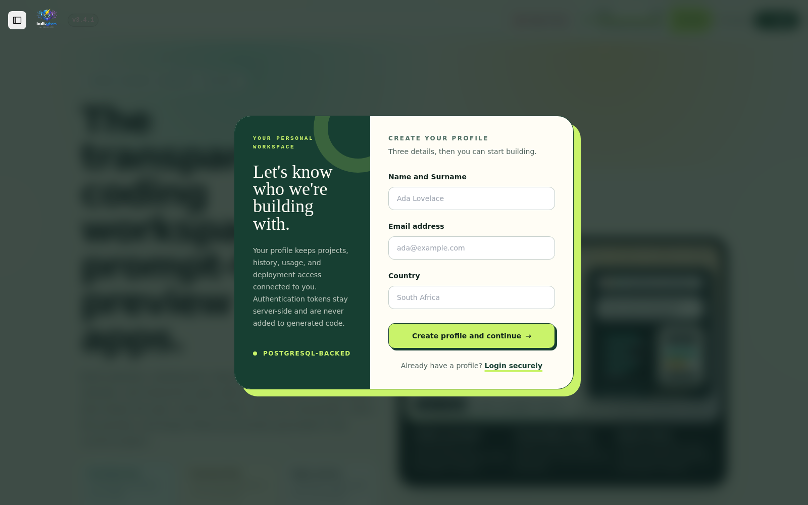

Generated Tideboard app in the restored live Preview:
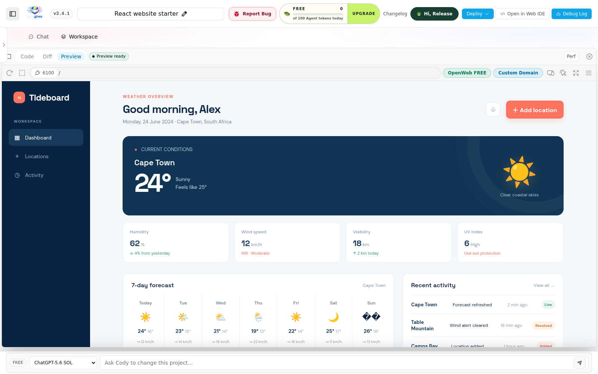

FREE service pause modal after the 100-Agent-token daily allocation:
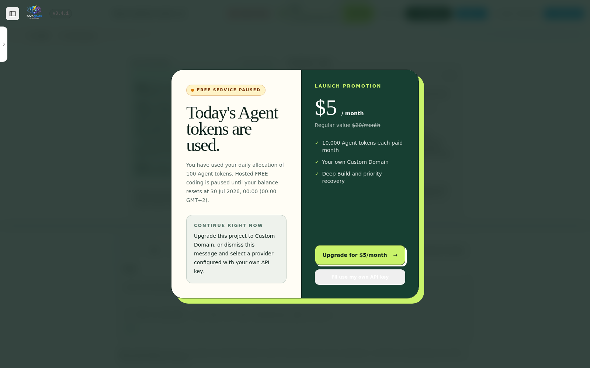

Custom Domain pricing with the `$5/month` launch promotion and `$20/month` regular value:
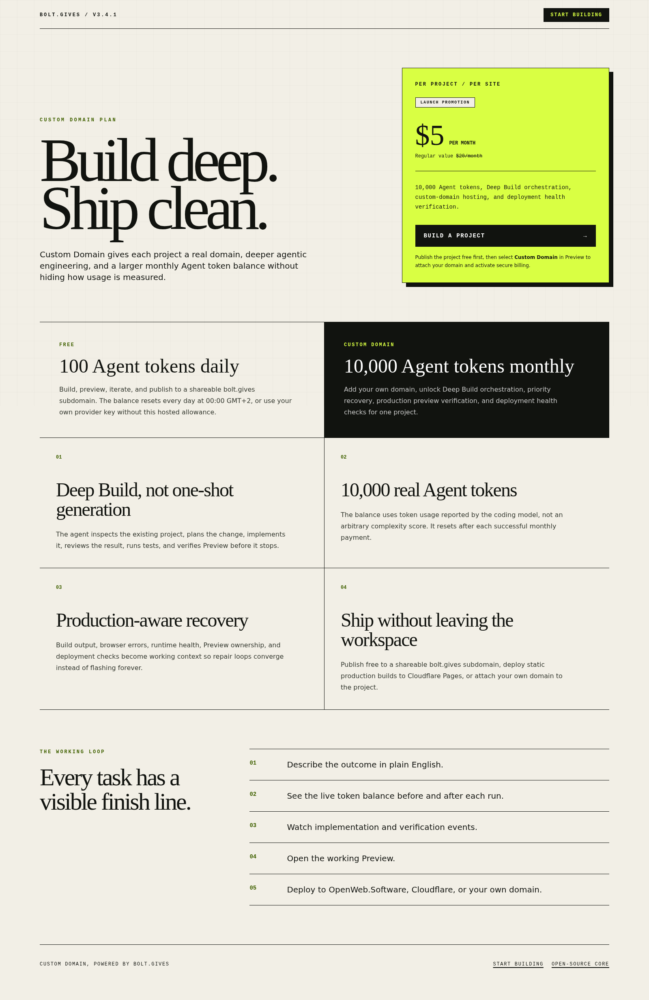

Real v3.2.0 Calendar E2E on `alpha1.bolt.gives` after first-pass generation, a follow-up change, saved-history restoration, and isolated PostgreSQL verification:
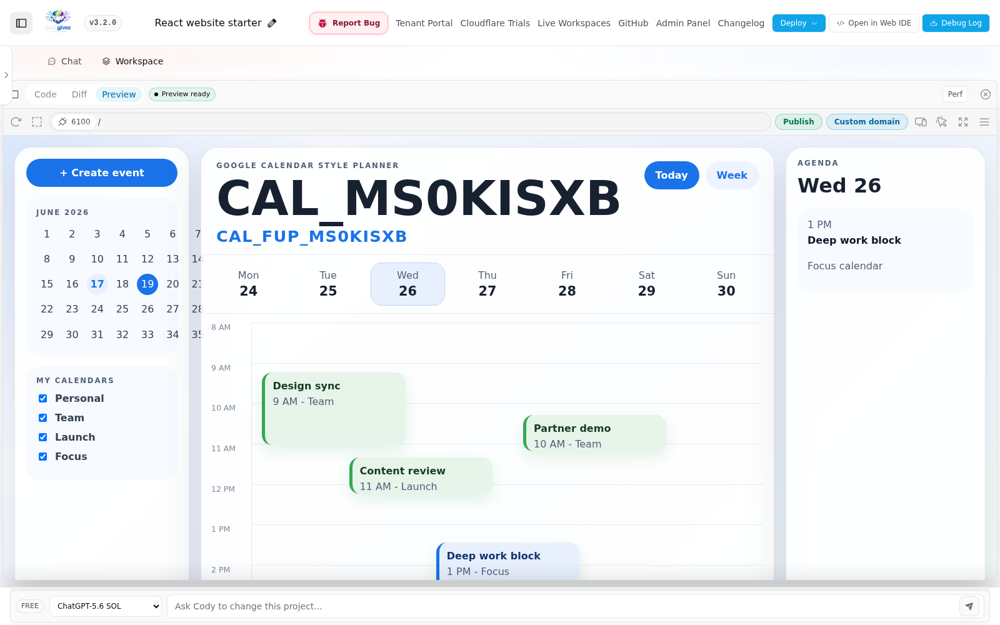

Home:
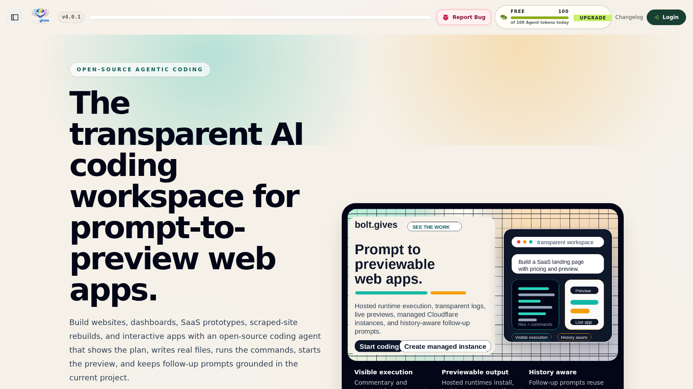

Chat:
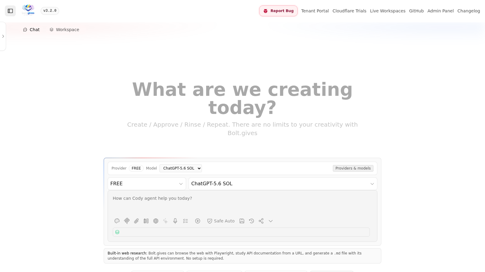

Plan prompt example:
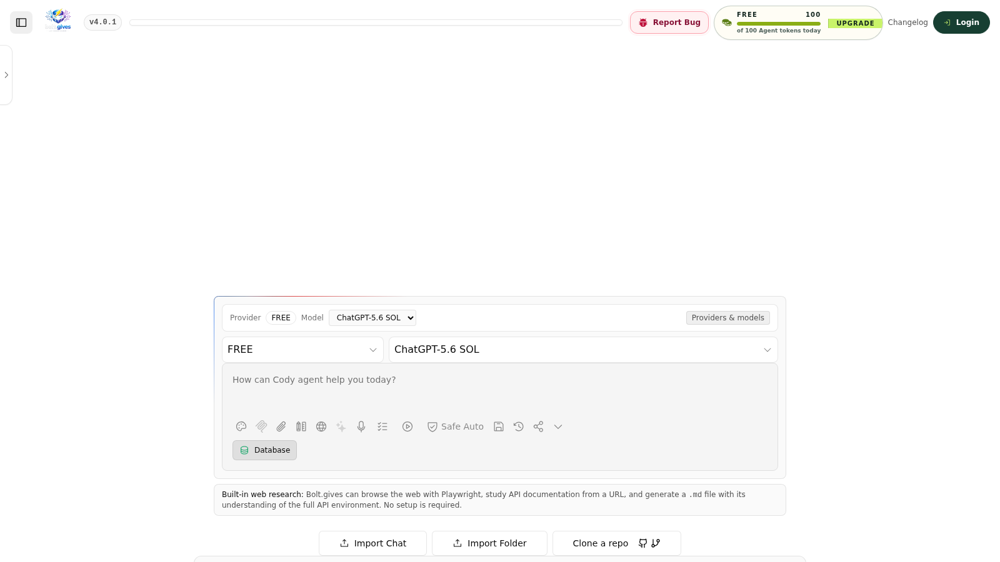

Workspace:
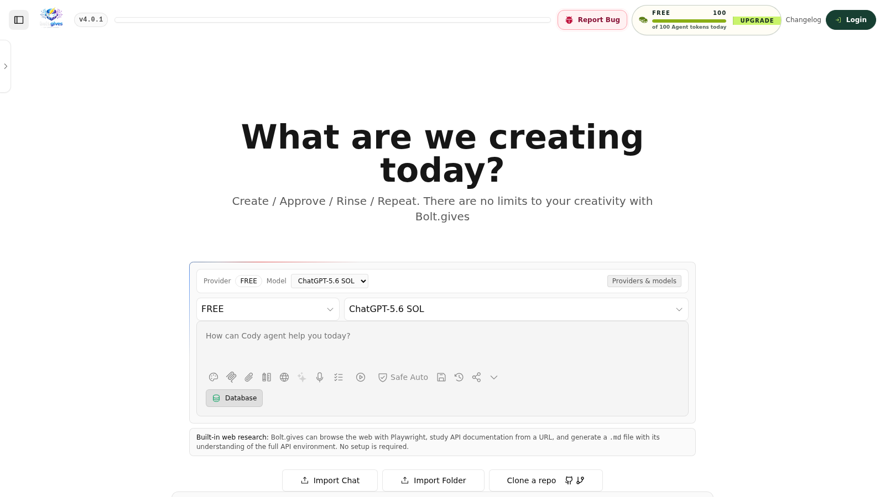

Changelog:
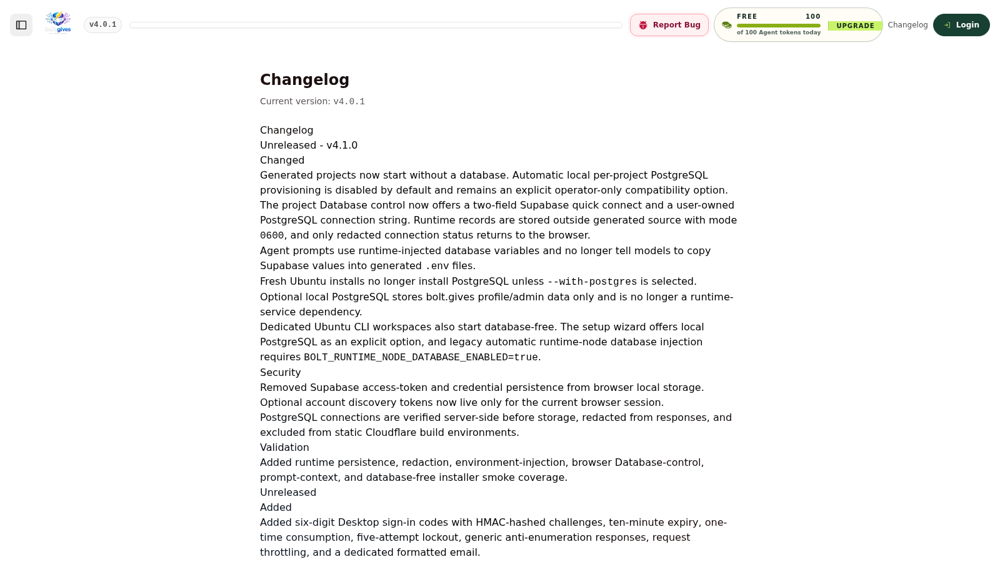

## Installation (Ubuntu 18.04+ Only, Verbose, Tested)

This installation path is designed to let users self-host the full product on their own VPS:

- public app domain
- public admin/operator domain
- optional public create/trial-registration domain
- local PostgreSQL for the private admin/control-plane data
- Caddy-managed HTTPS on the chosen domains

Core coding stays open source and self-hostable. Sensitive server-side keys stay in `.env.local` and never need to be exposed to browser users.

### 0. What you need

- Ubuntu `18.04+` (recommended `22.04+`)
- A user account with `sudo` access
- Internet access for package installation and GitHub clone
- Public DNS A records for the domains the user wants to use, all pointing at the VPS IP

Recommended self-host domain layout:

- app: `code.example.com`
- admin: `admin.example.com`
- create: `create.example.com`

The `create` domain is optional. If it is omitted, the registration flow still works at:

- `https://<app-domain>/managed-instances`

Windows/macOS note:

- Windows users can use bolt.gives in the browser or install the hosted Desktop client from the `v3.4.2` GitHub release.
- macOS users should use the browser in this release; no macOS Desktop package is published yet.
- You should install/self-host bolt.gives on Ubuntu 18.04+.

### 1. Recommended: run the installer

Download the installer from GitHub, inspect it, then run it.

Simplest path:

```bash
curl -fsSL https://raw.githubusercontent.com/embire2/bolt.gives/main/install.sh -o install-bolt-gives.sh
chmod +x install-bolt-gives.sh
./install-bolt-gives.sh
```

If you run it without domain, PostgreSQL, or operator-credential flags, the installer now prompts interactively for the missing values.

Fully explicit path:

```bash
curl -fsSL https://raw.githubusercontent.com/embire2/bolt.gives/main/install.sh -o install-bolt-gives.sh
chmod +x install-bolt-gives.sh
./install-bolt-gives.sh \
  --app-domain code.example.com \
  --admin-domain admin.example.com \
  --create-domain create.example.com
```

The installer will:

- install `git`, `curl`, `ca-certificates`, and `build-essential`
- install `python3`
- install Node.js `22.x`
- install a compatible `pnpm 9.x` release (repo-pinned to `9.14.4`)
- install local `PostgreSQL`, `psql`, and create a dedicated local admin/control-plane database
- install `Caddy` and configure HTTPS reverse-proxy blocks for the chosen public domains
- clone or update `https://github.com/embire2/bolt.gives`
- create `.env.local` from `.env.example` if it does not exist
- write self-host public URLs into `.env.local` for:
  - `BOLT_APP_PUBLIC_URL`
  - `BOLT_ADMIN_PANEL_PUBLIC_URL`
  - `BOLT_CREATE_TRIAL_PUBLIC_URL`
- write local PostgreSQL connection settings into `.env.local` for:
  - `BOLT_ADMIN_DATABASE_HOST`
  - `BOLT_ADMIN_DATABASE_PORT`
  - `BOLT_ADMIN_DATABASE_NAME`
  - `BOLT_ADMIN_DATABASE_USER`
  - `BOLT_ADMIN_DATABASE_PASSWORD`
  - `BOLT_ADMIN_DATABASE_SSL=disable`
- generate independent private `BOLT_TENANT_ADMIN_COOKIE_SECRET`, `BOLT_PROFILE_COOKIE_SECRET`, `BOLT_HOSTED_FREE_RELAY_SECRET`, `BOLT_FREE_USAGE_QUOTA_SECRET`, and `BOLT_PREMIUM_INTERNAL_SECRET` values
- write the local runtime-control URL, 100-token FREE allowance, 10,000-token Custom Domain allowance, and `$5/month` launch price
- preserve Stripe settings supplied through the process environment, warn when Stripe is only partially configured, and set `.env.local` permissions to `0600`
- seed the private tenant registry with your chosen operator/admin username and password hash on first install
- build the app with a **4 GB** Node heap (`NODE_OPTIONS=--max-old-space-size=4096`)
- install and start these systemd services:
  - `bolt-gives-app`
  - `bolt-gives-collab`
  - `bolt-gives-webbrowse`
  - `bolt-gives-runtime`

The `bolt-gives-app` launcher serves the precompiled Pages Functions worker directly under Node. Wrangler remains available for local development and Cloudflare deployment, but the production request path no longer depends on a long-lived Wrangler/esbuild watcher that can interrupt an active coding stream. The app worker uses a separate 1.5 GB heap default; build and agent-runtime processes retain their larger memory allowance.

If the domain or PostgreSQL flags are omitted, the installer now prompts interactively for:

- public app domain
- public admin domain
- optional public create/trial domain
- Let's Encrypt contact email
- local PostgreSQL database name
- local PostgreSQL user
- optional local PostgreSQL password (blank = generated)
- private operator/admin username
- private operator/admin password

If a recoverable step fails, the installer now retries and repairs the common failure paths before giving up:

- apt / dpkg state
- pnpm dependency install state
- build artifacts and Vite cache
- service startup and first HTTP health check

Recommended real-world installer command:

```bash
curl -fsSL https://raw.githubusercontent.com/embire2/bolt.gives/main/install.sh -o install-bolt-gives.sh
chmod +x install-bolt-gives.sh
./install-bolt-gives.sh \
  --app-domain code.example.com \
  --admin-domain admin.example.com \
  --create-domain create.example.com \
  --postgres-db bolt_gives_admin \
  --postgres-user bolt_gives_admin
```

Optional overrides:

```bash
INSTALL_DIR="$HOME/apps/bolt.gives" ./install-bolt-gives.sh
```

After the installer finishes:

- app: `http://127.0.0.1:5173`
- collaboration server: `ws://127.0.0.1:1234`
- web browsing service: `http://127.0.0.1:4179`
- runtime control plane: `http://127.0.0.1:4321`
- admin panel: `https://admin.example.com` (or whatever `--admin-domain` was set to)
- trial registration: `https://create.example.com` (or `https://<app-domain>/managed-instances` if `--create-domain` was omitted)
- operator login: `https://admin.example.com/tenant-admin` using the private username/password you chose during install

The raw operator password is never committed and is not stored in browser code. The installer hashes it into the local tenant registry on your VPS so the self-hosted admin panel does not fall back to the insecure bootstrap `admin / admin` default.

### 2. Add your provider keys

The installer creates `.env.local` for you. Edit it after install:

```bash
cd ~/bolt.gives
nano .env.local
```

Then restart the services:

```bash
sudo systemctl restart bolt-gives-app bolt-gives-collab bolt-gives-webbrowse bolt-gives-runtime
```

bolt.gives core still does not require an external hosted database, but the full self-hosted operator stack now supports a local PostgreSQL service for:

- registered client profiles
- managed Cloudflare trial assignments
- admin/operator email activity

Important:

- keep `MAGNET_API_KEY` on the canonical server only
- keep any `OPENAI_API_KEY`, `OPEN_ROUTER_API_KEY`, or other provider secrets on the server only unless the user intentionally wants browser-local key entry
- never commit `.env.local`

Hosted-instance note:

- If you run a managed/shared instance, define `MAGNET_API_KEY` on the canonical server to expose the allowlisted hosted coders without exposing the token to users.
- Keep `OPEN_ROUTER_API_KEY` unset on hosted/shared instances if you want the public `OpenRouter` provider to remain user-supplied.
- The hosted `FREE` coder is restricted to ChatGPT-5.6 SOL, Opus 4.8, Sonnet 5, and Fable 5. If a selected route is unavailable, the UI surfaces a clear retry/switch-provider error instead of silently routing to an unapproved model.
- Managed Cloudflare instances do not receive the MagnetAPI token itself. They receive a server-only relay secret on the Pages project, and the live app relays hosted FREE requests back to the operator runtime without exposing the upstream token.
- Operators can run `pnpm run cloudflare:sync-free-provider -- --include-managed` after a Cloudflare deploy to refresh the canonical Pages project plus active managed Pages projects with the hosted FREE relay and quota config. Follow with `pnpm run smoke:free-provider` to verify `alpha1.bolt.gives`, `bolt.gives`, and `bolt-gives.pages.dev` do not ask for user API keys.
- Hosted FREE relay authorization falls back to the local runtime service on the operator host, so all four built-in MagnetAPI.org choices work on Pages-hosted managed trials without asking users for their own API key.
- Chat history persistence is browser-only and initializes only when IndexedDB exists, so Cloudflare/SSR rendering does not try to open client storage. Each record stores the full conversation, source snapshot, and non-secret runtime session ID required to reopen the same project workspace and database from that browser.
- Hosted preview autostart waits for the managed runtime `ready` event before reporting success, which keeps live follow-up prompts attached to a verified current project instead of a preview stuck in `starting`.
- Live browser E2E checks can require generated and follow-up tokens to persist in the hosted runtime snapshot, reopen the project through sidebar history under the same runtime session, and verify that the dedicated PostgreSQL tunnel reports connected, with bounded snapshot/status fetch timeouts so release validation cannot hang silently.

### 3. Verify the install

```bash
sudo systemctl status bolt-gives-app --no-pager
sudo systemctl status bolt-gives-collab --no-pager
sudo systemctl status bolt-gives-webbrowse --no-pager
sudo systemctl status bolt-gives-runtime --no-pager
sudo systemctl status postgresql --no-pager
sudo systemctl status caddy --no-pager
```

Open `http://127.0.0.1:5173`, then verify:

- UI loads without a server crash
- chat opens
- terminal and preview panels render
- collaboration and web browsing helper services are reachable
- the admin domain loads the tenant/operator panel
- the create domain loads the managed trial registration form

Recommended public checks after DNS is pointed:

- `https://code.example.com`
- `https://admin.example.com`
- `https://create.example.com`

If the user skips a dedicated create domain, the installer falls back to:

- `https://code.example.com/managed-instances`

### 4. Manual install alternative

If you do not want to use the installer, this is the validated manual path for users who want to provision everything themselves.

```bash
sudo apt-get update
sudo apt-get install -y git curl ca-certificates build-essential python3 postgresql postgresql-client postgresql-contrib caddy
curl -fsSL https://deb.nodesource.com/setup_22.x | sudo -E bash -
sudo apt-get install -y nodejs
sudo npm install -g pnpm@9.14.4
git clone https://github.com/embire2/bolt.gives.git
cd bolt.gives
cp .env.example .env.local
sudo -u postgres createuser --pwprompt bolt_gives_admin
sudo -u postgres createdb --owner=bolt_gives_admin bolt_gives_admin
cat >> .env.local <<'EOF'
BOLT_ADMIN_PANEL_PUBLIC_URL=https://admin.example.com
BOLT_CREATE_TRIAL_PUBLIC_URL=https://create.example.com
BOLT_ADMIN_DATABASE_HOST=127.0.0.1
BOLT_ADMIN_DATABASE_PORT=5432
BOLT_ADMIN_DATABASE_NAME=bolt_gives_admin
BOLT_ADMIN_DATABASE_USER=bolt_gives_admin
BOLT_ADMIN_DATABASE_PASSWORD=replace_me
BOLT_ADMIN_DATABASE_SSL=disable
EOF
pnpm install --frozen-lockfile || pnpm install
NODE_OPTIONS=--max-old-space-size=4096 pnpm exec remix vite:build
```

Run it locally:

```bash
# terminal 1
NODE_OPTIONS=--max-old-space-size=4096 pnpm run collab:server

# terminal 2
NODE_OPTIONS=--max-old-space-size=4096 pnpm run webbrowse:server

# terminal 3
NODE_OPTIONS=--max-old-space-size=4096 pnpm run start
```

Then place Caddy in front of the app with the chosen domains:

```caddyfile
code.example.com {
  encode zstd gzip
  header {
    Cache-Control "no-store, max-age=0, must-revalidate"
  }

  handle /runtime/* {
    reverse_proxy 127.0.0.1:4321
  }

  handle_path /collab/* {
    reverse_proxy 127.0.0.1:1234
  }

  handle {
    reverse_proxy 127.0.0.1:5173
  }
}

admin.example.com {
  encode zstd gzip
  @root path /
  redir @root /tenant-admin 302

  handle /runtime/* {
    reverse_proxy 127.0.0.1:4321
  }

  handle_path /collab/* {
    reverse_proxy 127.0.0.1:1234
  }

  handle {
    reverse_proxy 127.0.0.1:5173
  }
}

create.example.com {
  encode zstd gzip
  @root path /
  redir @root /managed-instances 302

  handle /runtime/* {
    reverse_proxy 127.0.0.1:4321
  }

  handle_path /collab/* {
    reverse_proxy 127.0.0.1:1234
  }

  handle {
    reverse_proxy 127.0.0.1:5173
  }
}
```

### 5. Contributor note about memory

The repo still contains heavier maintainer scripts used for large local test/build workflows.  
The installer and manual self-host path above are the validated open-source install path and run with a **4 GB** Node heap.

## Deploying To Cloudflare Pages (Verbose, Step By Step)

This is the **supported self-service Cloudflare path that works today**.

What this gives the user right now:

- their own isolated Cloudflare Pages deployment
- their own chosen `*.pages.dev` project name
- optional custom domain after the first deploy
- automatic redeploys from GitHub when they push updates

What this does **not** give yet:

- live managed trial provisioning on a runtime that does not have `CLOUDFLARE_API_TOKEN` and `CLOUDFLARE_ACCOUNT_ID` configured

The managed trial control plane is now part of the product under `/managed-instances`. It becomes operational on a given deployment only when the runtime has the required Cloudflare credentials configured.

### 1. Prerequisites

Before starting, the user needs:

- a Cloudflare account
- a GitHub account
- a fork or clone of `https://github.com/embire2/bolt.gives`
- Node.js `22.x` and `pnpm 9.x` locally if they want to test before connecting Git

### 2. Prepare the repo

If the user wants to test locally first:

```bash
git clone https://github.com/embire2/bolt.gives.git
cd bolt.gives
pnpm install
NODE_OPTIONS=--max-old-space-size=3072 pnpm run build
```

This repo is already configured for Cloudflare Pages in `wrangler.toml`:

- build output directory: `build/client`
- Pages Functions entry: `functions/[[path]].ts`
- compatibility flag: `nodejs_compat`

### 3. Create the Pages project in Cloudflare

In the Cloudflare dashboard:

1. Open `Workers & Pages`
2. Click `Create`
3. Choose `Pages`
4. Choose `Connect to Git`
5. Select the GitHub repository the user wants to deploy

The **project name** becomes the default `*.pages.dev` subdomain.

Example:

- project name: `my-bolt-gives`
- default URL: `https://my-bolt-gives.pages.dev`

If the user wants a different public URL later, they can attach a custom domain after the first successful deploy.

### 4. Use these exact Cloudflare build settings

Use the following values in the Cloudflare Pages setup form:

- Framework preset: `None`
- Root directory: `/`
- Build command: `NODE_OPTIONS=--max-old-space-size=3072 pnpm run build`
- Build output directory: `build/client`

Do **not** point Pages at another output folder. This project expects `build/client`.

### 5. Set the required environment variables in Pages

In Cloudflare Pages, open:

- `Settings`
- `Environment variables`

Set at least:

- `NODE_OPTIONS=--max-old-space-size=3072`

Optional, depending on how they want the AI runtime to behave:

- `MAGNET_API_KEY=...`
  - Use this only if they want the built-in hosted `FREE` provider to work on **their** deployment.
  - This stays server-side in Cloudflare. It is **not** exposed to browser users.
  - The shipped FREE path is restricted to `gpt-5.6-sol`, `claude-opus-4-8`, `claude-sonnet-5`, and `claude-fable-5`.
- `BOLT_FREE_DAILY_USD_LIMIT=1`
  - Optional override for hosted `FREE` daily spend per person.
  - The default is `$1` and the ledger resets at `00:00 GMT+2`.
- `BOLT_FREE_USAGE_QUOTA_SECRET=...`
  - Optional dedicated secret for app-to-runtime quota writes.
  - If unset, the hosted FREE relay secret is reused.
- `OPENAI_API_KEY=...`
  - Optional if they want OpenAI available server-side by default on their own instance.
- `OPEN_ROUTER_API_KEY=...`
  - Optional for their own OpenRouter-backed server-side use cases.
  - Leave this unset if they want OpenRouter to remain entirely user-supplied in the UI.

Important:

- The open-source app does **not** expose `MAGNET_API_KEY` to end users.
- If an operator wants a deployment to ship with a working FREE coder, set `MAGNET_API_KEY` only on the canonical server/runtime.
- Hosted operator deployments send managed Pages projects relay credentials, never the MagnetAPI token.

### 6. First deploy

Once the Git repo and build settings are connected:

1. Click `Save and Deploy`
2. Wait for the build to complete
3. Open the generated `*.pages.dev` URL

On first load, the expected default UX is:

- land on `Chat`
- provider already set to `FREE`
- model selector already showing `ChatGPT-5.6 SOL`, with Opus 4.8, Sonnet 5, and Fable 5 available

### 7. Give the user their own subdomain

Users have two options:

1. Use their Cloudflare Pages project name as the default subdomain
   - example: `clinic-bolt.pages.dev`
2. Attach a custom domain in:
   - `Workers & Pages`
   - selected project
   - `Custom domains`

That means users can already choose their own public address today without waiting for the future managed trial control plane.

### 8. Automatic updates from GitHub

If the project is connected through Cloudflare Pages Git integration:

- every push to the configured branch triggers a new deployment automatically
- this is the easiest way to keep the instance updated from GitHub

If they want the production instance to track stable releases only:

- connect Pages to `main`

If they want a soak-test instance:

- connect a separate Pages project to `alpha`

### 9. Troubleshooting memory or build failures

If the build runs out of memory:

- confirm at least 3 GB of Node heap plus adequate system memory or swap is available
- confirm the build command is exactly:
  - `pnpm run build`

If the UI loads but the FREE provider does not work:

- confirm `MAGNET_API_KEY` is set on the canonical server/runtime, not on managed Pages projects
- confirm the canonical runtime has a hosted FREE quota secret available through `BOLT_FREE_USAGE_QUOTA_SECRET` or `BOLT_HOSTED_FREE_RELAY_SECRET`
- for the hosted operator fleet, run `pnpm run cloudflare:sync-free-provider -- --include-managed` so Pages projects receive the relay secret, quota secret, and control origin while keeping the upstream model key on the operator host
- run `pnpm run smoke:free-provider` and check that each target returns `200`
- redeploy the project after saving env changes
- for managed Cloudflare instances, refresh the deployment from the operator/runtime control plane so the Pages relay secret is applied; end users should never need to enter a FREE API key manually

If the deploy succeeds but the URL still shows an older release:

- open the latest deployment in Pages
- confirm the connected Git branch and latest commit SHA
- trigger a redeploy from the newest commit

### 10. About the managed Cloudflare instance program

The shipped control-plane model is:

- free experimental shared runtime while capacity lasts
- future Pro from `$12/month` with more tools and higher limits

The shipped control plane now covers:

- user signs into bolt.gives
- user completes a short managed-instance profile, including email address
- the operator panel stores that client profile privately for support and messaging
- user requests a managed Cloudflare instance
- bolt.gives enforces one-client / one-instance ownership
- user chooses a subdomain
- the managed instance is currently available indefinitely unless the operator suspends it
- updates can roll forward from the current stable build through the runtime sync path

What still remains:

- live operator credential enablement on every managed runtime
- rollback verification on failed managed-instance updates
- deeper operator observability for managed-instance rollout state

Fresh install checklist:

- `docs/fresh-install-checklist.md`

## Built-In Web Browsing

bolt.gives can now browse docs from user prompts like:

- `Study these API documentation: https://developers.cloudflare.com/workers/`
- `Scrape https://example.com and build me a modern replacement website using its services, copy, and navigation data.`

How it works:

- The model uses built-in tools: `web_search` and `web_browse`.
- `web_browse` reads the target URL with Playwright and extracts title, headings, links, and body content.
- Direct public URLs in build prompts are also browsed before generation, and the extracted source context is appended to the model request automatically.
- If the Playwright browser handle goes stale, the browse sidecar relaunches Chromium and retries once instead of returning a persistent closed-browser `500`.
- The model can then create a Markdown study file directly in the workspace using `<boltAction type="file">`.

Configuration:

- `WEB_BROWSE_SERVICE_URL` (optional): URL for the browsing service.
  - Default: `http://127.0.0.1:4179`
- Browser install is handled during dependency install (`pnpm install`) via postinstall.
  - To skip browser download: `PLAYWRIGHT_SKIP_BROWSER_DOWNLOAD=1 pnpm install`

## Real-Time Collaboration

The editor uses Yjs and connects to a local `y-websocket` compatible server.

- Server script: `scripts/collaboration-server.mjs`
- Default WS URL: `ws://localhost:1234`
- Default persistence directory: `.collab-docs` (override with `COLLAB_PERSIST_DIR`)

Client settings (stored in browser localStorage):

- `bolt_collab_enabled` (defaults to enabled when unset)
- `bolt_collab_server_url` (defaults to `ws://localhost:1234`)

## Screenshots (Reproducible)

To refresh the screenshots used in this README:

```bash
./scripts/capture-screenshots.sh
```

Outputs:

- `docs/screenshots/home.png`
- `docs/screenshots/chat.png`
- `docs/screenshots/chat-plan.png`
- `docs/screenshots/system-in-action.png`
- `docs/screenshots/changelog.png`

Release-gate browser evidence committed for `v3.4.1`:

- `docs/screenshots/profile-onboarding-v3.4.1.png`
- `docs/screenshots/tideboard-preview-v3.4.1.png`
- `docs/screenshots/free-plan-paused-v3.4.1.png`
- `docs/screenshots/pricing-v3.4.1.png`

To capture screenshots from the live alpha environment instead of a local dev server:

```bash
SKIP_DEV_SERVER=1 BASE_URL=https://alpha1.bolt.gives ./scripts/capture-screenshots.sh
```

To generate a shared-session restore screenshot (requires Supabase configured in `.env.local`):

```bash
node scripts/e2e-sessions-share-link.mjs
```

## Validation Gate

Before pushing changes:

```bash
pnpm run typecheck
pnpm run lint
pnpm test
pnpm run gate:release:live
```

`gate:release:live` checks:

- both live domains (`alpha1.bolt.gives` and `ahmad.bolt.gives`) return healthy pages
- live version + changelog version match `package.json`
- screenshot capture assertions pass (no server-error capture states, expected dimensions, non-empty output)

GitHub build jobs use Node 22.22 because the current Wrangler 4 precompiler requires Node 22 or newer. The release workflow starts the compiled production worker locally before running screenshot, startup-label, and asset-health gates; provider-backed generation is reported as skipped when its optional GitHub Actions secret is not configured.

## Docker Images (GHCR)

This repo includes a `Docker Publish` GitHub Actions workflow that can build and (optionally) push images to GitHub Container Registry.

By default, publishing is disabled. To enable pushing to GHCR:

1. Create an Actions variable: `GHCR_PUSH_ENABLED=true`
2. (Optional) Create an Actions secret: `GHCR_PAT` with `read:packages` and `write:packages`

Notes:

- If `GHCR_PAT` is not set, the workflow will fall back to the built-in `GITHUB_TOKEN`.
- Images publish to `ghcr.io/<owner>/<repo>`.

## Contributing (Fork + PR Workflow)

We follow a standard GitHub fork + PR workflow.

1. Fork this repository on GitHub.
2. Clone your fork locally:
   ```bash
   git clone https://github.com/<your-username>/bolt.gives.git
   cd bolt.gives
   ```
3. Add the upstream remote:
   ```bash
   git remote add upstream https://github.com/embire2/bolt.gives.git
   git fetch upstream
   ```
4. Create a branch off `main`:
   ```bash
   git checkout -b feat/my-change
   ```
5. Make changes and run the validation gate:
   - `pnpm run typecheck`
   - `pnpm run lint`
   - `pnpm test`
6. Push your branch to your fork and open a Pull Request targeting `embire2/bolt.gives:main`.

PR expectations:

- Keep PRs focused (one feature/bugfix per PR).
- Explain what changed, why, and how reviewers can verify it.
- Do not commit secrets. Put keys in `.env.local` (gitignored).

## License

MIT
