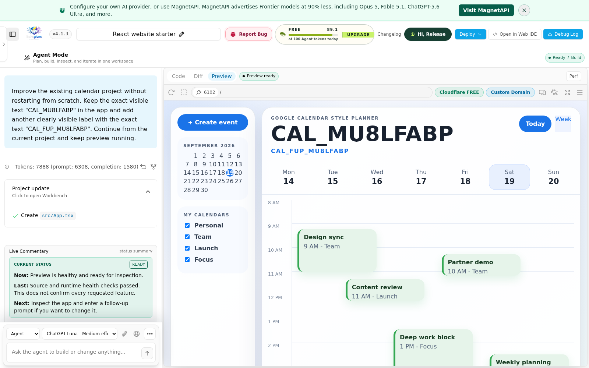

# Dedicated Cloudflare Alpha

Created 19 September 2026 for open-source bolt.gives testing.

## Routing and Ownership

- Application: <https://alpha.bolt.gives/chat>
- Cloudflare Pages project: `bolt-gives-alpha`
- Assigned Pages hostname: `bolt-gives-alpha.pages.dev`
- Canonical deployment branch within this Pages project: `alpha`
- Backend: the existing `https://alpha1.bolt.gives` app/runtime, using `/srv/bolt-gives-alpha-isolated` and its separate alpha workspace tree.
- Generated Preview: signed per-project TLS on `*.alpha-preview.instances.bolt.gives`, not production workspaces.

This is a dedicated Cloudflare frontend, not an additional Ubuntu server. It shares the existing alpha backend and alpha account/project data; it does not share production project directories. It is deliberately outside the customer fleet registry so an automatic production refresh cannot overwrite a candidate.

The initial deployment used stable source `2b35ed57fa506da24fce214649aadcab7c75d2a2` (v4.1.1). Subsequent gateway corrections are candidate changes, not a published stable version. Do not treat the application's base version label alone as proof that a candidate is shipped.

Only the previous `alpha.bolt.gives` A record was replaced with a CNAME to its assigned Pages hostname. The custom domain was registered with Cloudflare before DNS changed. All four authoritative nameservers resolve the new CNAME and Cloudflare reports the domain active. Other DNS records, `alpha1.bolt.gives`, production services and customer instances were not changed.

## Secrets and Deployment

Cloudflare receives protected runtime/relay/session bindings from the root-protected alpha configuration. The upstream MagnetAPI key remains on the backend. Never copy credentials into source, documentation or deployment logs.

Build and validate the candidate first. Deploy to project `bolt-gives-alpha` with `--branch alpha`; another Pages branch produces a preview deployment and will not necessarily update `alpha.bolt.gives`. Record the canonical deployment ID and source commit. Compile the current `functions/[[path]].ts` as well as application assets; copying only frontend output can leave the gateway stale.

Do not refresh the production fleet, change production's protected release SHA, or restart production services as part of alpha testing. Restore a known-good deployment within this test project if a candidate fails; never restore older project directories over newer data.

## Acceptance

Basic provisioning checks passed: valid public HTTPS, `GET /api/health?ready=1` returning ready with runtime health, and an actual WebSocket upgrade at `/collab/events`. Initial browser generation displayed a Calendar app in Preview.

The baseline exposed missing custom-domain collaboration routing, now corrected with gateway regressions and a live handshake. It also exposed a Luna-only follow-up not reaching Preview; one repeat restored the previous healthy source. These failed runs **are not passing complete E2Es**, and this failure remains open.

A subsequent real-provider Chromium journey passed in 262 seconds: Luna generation, switching to Sonnet for a follow-up, both requested labels in Preview and source, history navigation/reload with the same runtime and no replayed mutations, public Cloudflare publishing, and a stopped runtime remaining stopped. A separate anonymous browser loaded the public app after shutdown. There were no fatal browser/network errors or failed collaboration sockets; the evidence still includes existing iframe warnings and lifecycle-aborted requests. Do not generalize this model-switch pass to Luna-only follow-ups.

Candidate checks: 1,485 unit/integration tests passed, nine skipped; 152 surfaces-module tests passed; boundaries, typecheck, lint, build and bundle budgets passed. Lint retains ten existing warnings. Public source and client artifacts passed the configured-credential scan. These checks cover the gateway candidate, not the unfinished Supabase rewrite.

Before promoting any candidate, a normal authenticated browser must generate a project, render Preview, apply a follow-up to the same project, restore its history after navigation/reload, publish it, and load the public app after its coding runtime stops. Browser exceptions, cancellation, stale output and failed WebSockets are not acceptable substitutes for that evidence.

Use disposable test profiles and projects. Do not enter production customer data or real payment details. The optional external SSH CLI node remains a separate known availability limitation; a failed remote CLI provision must never be described as successful.
